#
# 3MF Toolpath Extension

## Specification & Reference Guide


| **Version** | 1.0 |
| --- | --- |
| **Status** | Release Candidate |

## Table of Contents

[Preface](#preface)

- [1.1. About this Specification](#11-about-this-specification)
- [1.2. Document Conventions](#12-document-conventions)
- [1.3. Language Notes](#13-language-notes)
- [1.4. Software Conformance](#14-software-conformance)

[Part I: 3MF Documents](#part-i-3mf-documents)

- [Chapter 1. Overview of Additions](#chapter-1-overview-of-additions)
  - [Additions to the core model schema](#additions-to-the-core-model-schema)
- [Chapter 2. Planar toolpathes and 3-axis to 6 axis deposition toolpathes.](#chapter-2-planar-toolpathes-and-3-axis-to-6-axis-deposition-toolpathes)
  - [2.1 Planar Toolpaths](#21-planar-toolpaths)
  - [2.2 Multi Axis Deposition Toolpaths (3-6 axes)](#22-multi-axis-deposition-toolpaths-3-6-axes)
  - [2.3 Machine specific profile codecs](#23-machine-specific-profile-codecs)
- [Chapter 3. OPC Packet Structure](#chapter-3-opc-packet-structure)
  - [3.1 Layer-Scoped XML Parts](#31-layer-scoped-xml-parts)
  - [3.2 Relationships and Binding](#32-relationships-and-binding)
- [Chapter 4. Toolpath Resource XML Structure](#chapter-4-toolpath-resource-xml-structure)
  - [4.1 Toolpath profiles](#41-toolpath-profiles)
  - [4.2 Toolpath profile modifiers](#42-toolpath-profile-modifiers)
    - [Overview and rationale](#overview-and-rationale)
    - [Example: per-hatch power modulation](#example-per-hatch-power-modulation)
  - [4.3 Toolpath layers](#43-toolpath-layers)
  - [4.4 Custom Toolpath Metadata](#44-custom-toolpath-metadata)
  - [4.5 Laser Sources](#45-laser-sources)
  - [4.6 Selecting a toolpath for the build](#46-selecting-a-toolpath-for-the-build)

[Part II. Layer Data](#part-ii-layer-data)

- [Chapter 1 - Layer ASCII XML Structure](#chapter-1---layer-ascii-xml-structure)
  - [1.1. References to Parts and Profiles](#11-references-to-parts-and-profiles)
    - [1.1.1 Parts](#111-parts)
    - [1.1.2 Profiles](#112-profiles)
    - [1.1.3 Custom Layer Metadata](#113-custom-layer-metadata)
  - [1.2. Segment Data](#12-segment-data)
    - [1.2.1 Children of Segment](#121-children-of-segment)
    - [1.2.2 Parallel Execution and Laser Synchronization](#122-parallel-execution-and-laser-synchronization)
  - [1.3. Planar Segment Data](#13-planar-segment-data)
    - [1.3.1 Polyline Segment (planar)](#131-polyline-segment-planar)
    - [1.3.2 Loop Segment (planar)](#132-loop-segment-planar)
    - [1.3.3 Hatch Segment (planar)](#133-hatch-segment-planar)
  - [1.4. Non-Planar Segment Data](#14-non-planar-segment-data)
    - [1.4.1 Polyline Segment (3 axis)](#141-polyline-segment-3-axis)
    - [1.4.2 Polyline Segment (6 axis)](#142-polyline-segment-6-axis)

[Part III. Appendixes](#part-iii-appendixes)

- [Appendix A. Glossary](#appendix-a-glossary)
- [Appendix B. 3MF XSD Schema](#appendix-b-3mf-xsd-schema)
  - [B.1 Additions to core types](#b1-additions-to-core-types)
  - [B.2 Toolpath schema](#b2-toolpath-schema)
- [Appendix C. Standard Namespace](#appendix-c-standard-namespace)
- [Appendix D: Example file](#appendix-d-example-file)

[References](#references)


# Preface

## 1.1. About this Specification

This 3MF toolpath specification is an extension to the core 3MF specification. This document does not stand alone and only applies as an addendum to the core 3MF specification. Usage of this and any other 3MF extensions follow an a la carte model, defined in the core 3MF specification.

Part I, "3MF Documents," presents the details of the primarily XML-based 3MF Document format. This section describes the XML markup that defines the toolpath resource, its profiles, modifiers, laser sources, and per-layer references within the model document.

Part II, "Layer Data," defines the representation of an individual toolpath layer and the rules for interpreting its geometry.

Part III, "Appendixes," contains additional technical details and schemas too extensive to include in the main body of the text as well as convenient reference information.

The information contained in this specification is subject to change. Every effort has been made to ensure its accuracy at the time of publication.

This extension MUST be used only with Core specification 1.x. and Production extension specification 1.x.

## 1.2. Document Conventions

Except where otherwise noted, syntax descriptions are expressed in the ABNF format as defined in RFC 4234.

Glossary terms are formatted like _this_.

Syntax descriptions and code are formatted in `monospace` type.

Replaceable items, that is, an item intended to be replaced by a value, are formatted in _`monospace cursive`_ type.

Notes are formatted as follows:

>**Note:** This is a note.

## 1.3. Language Notes

In this specification, the words that are used to define the significance of each requirement are written in uppercase. These words are used in accordance with their definitions in RFC 2119, and their respective meanings are reproduced below:

- _MUST._ This word, or the adjective "REQUIRED" means that the item is an absolute requirement of the specification.
- _SHOULD._ This word, or the adjective "RECOMMENDED" means that there are valid reasons in particular circumstances to ignore this item, but the full implications should be understood and the case carefully weighed before choosing a different course.
- _MAY._ This word, or the adjective "OPTIONAL" means that this item is truly optional. For example, one implementation may choose to include the item because a particular marketplace or scenario requires it or because it enhances the product. Another implementation may omit the same item.

## 1.4. Software Conformance

Most requirements are expressed as format or package requirements rather than implementation requirements.

In order for consumers to be considered conformant, they must observe the following rules:

- They MUST NOT report errors when processing conforming instances of the document format except when forced to do so by resource exhaustion.
- They SHOULD report errors when processing non-conforming instances of the document format when doing so does not pose an undue processing or performance burden.

In order for producers to be considered conformant, they must observe the following rules:

- They MUST NOT generate any new, non-conforming instances of the document format.
- They MUST NOT introduce any non-conformance when modifying an instance of the document format.

Editing applications are subject to all of the above rules.


# Part I: 3MF Documents

# Chapter 1. Overview of Additions

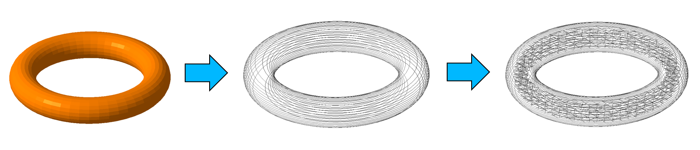

This specification defines the Toolpath Extension for the 3MF file format. It introduces a standardized way to describe toolpath-based fabrication processes within 3MF documents, extending the existing slice-based representation to include precise motion and exposure instructions.

The Toolpath Extension enables detailed modeling of additive manufacturing processes across laser based technologies, with provisions for future use in deposition and hybrid systems. It supports 2.5-axis (planar), 3-axis, and 6-axis toolpaths, as well as multi-head synchronization and machine-specific parameters.

The extension is designed with flexibility and scalability in mind, allowing for:

- High-resolution geometric and exposure data per layer (e.g. laser power).

- Random layer access with minimal loading and memory overhead.

- Support for deterministic binary encoding.

- Extensibility through profiles, metadata, and proprietary namespaces

- Efficient compression and streaming of large datasets.

This specification MUST be supported by consumers that advertise support for the Toolpath Extension. While all toolpath elements are optional for producers, any producer using this extension MUST declare it as required in the 3MF package, as specified in the core 3MF standard. 

Consumers MAY choose to recalculate or reinterpret the toolpath data, but they MUST retain compatibility with the declared structure and semantics of the extension. Further customization is possible via private extensions or print ticket annotations.

The goal of this extension is to offer a structured, vendor-neutral, and scalable foundation for toolpath data that can bridge the gap between 3D geometry and machine execution, supporting the evolving ecosystem of industrial and open-source additive manufacturing systems.

The producer of a 3MF document with the toolpath extension MUST also include the production extension as required. A consumer of the toolpath extension MUST  also understand the production extension in the document. This ensures the availability of proper referenceable UUIDs throughout the document.

## Additions to the core model schema

The Toolpath Extension makes two additions to the core 3MF model document:

1. A new resource type, **\<tp\:toolpathresource>**, is added to the core **CT_Resources** group. A toolpath resource collects the toolpath profiles, the per-layer references, and optional laser-source metadata for one fabrication process.
2. An optional attribute, `tp:toolpathid`, is added to the core **\<build>** element. It selects which toolpath resource is to be used to fabricate the build (see [§4.6 Selecting a toolpath for the build](#46-selecting-a-toolpath-for-the-build)).

No other core elements are modified. The relationship between the new and existing elements is illustrated below.


The formal schema deltas for **CT_Resources** and **\<build>** are given in [Appendix B.1](#appendix-b-3mf-xsd-schema).


# Chapter 2. Planar toolpathes and 3-axis to 6 axis deposition toolpathes.

Additive manufacturing systems employ a wide range of motion and exposure technologies, from traditional planar layer-by-layer approaches to advanced multi-axis deposition strategies. The 3MF Toolpath Extension is designed to represent both categories in a unified and extensible framework.

## 2.1 Planar Toolpaths

Planar toolpaths describe geometry and process instructions that are confined to discrete, parallel layers along the Z-axis. This approach is commonly used in technologies such as:

- Stereolithography (SLA)

- Selective Laser Melting (SLM)

- Selective Laser Sintering (SLS)

- Fused Filament Fabrication (FFF)


Each layer consists of one or more 2D geometric primitives such as loops, polylines, and hatches. These are defined in the XY-plane and associated with a Z-height. This representation provides high resolution in XY and discrete control in Z, aligning closely with the native processing model of many industrial AM systems.

Planar toolpaths are especially well suited for:

- Layer-based exposure processes (e.g., galvanometer-driven laser systems)

- Parallelization of path execution (e.g., multi-laser platforms)

- Efficient compression and random access per layer

## 2.2 Multi Axis Deposition Toolpaths (3-6 axes)

Beyond planar systems, many additive processes now involve continuous motion in 3D space or require dynamic orientation of the tool or part. The Toolpath Extension supports:

- 3-axis toolpaths: Represented as spatial 3D polylines whose points carry a full `z` coordinate, so the tool position moves continuously in three dimensions. Used for freeform material deposition that follows non-planar paths (e.g. FFF or directed energy deposition), where the tool tip traces the deposited geometry directly. Tool orientation remains fixed; when orientation must also vary, a 6-axis toolpath is used instead.

- 6-axis toolpaths: Represented as a 3 linear and 3 rotational values per point. This is required in robotic or multi-DOF systems where tool orientation is dynamically controlled (e.g., Directed Energy Deposition with a robot arm).

Each axis mode introduces increasing geometric and processing complexity but allows for:

- Non-planar slicing

- Conformal toolpaths

- Deposition on curved or dynamically repositioned surfaces

- Support for rotating or tilting buildplates, recoaters, or tool heads

3MF supports both representations under the same <toolpathlayers> construct, allowing for a consistent approach to synchronization, metadata assignment, and profile referencing.


## 2.3 Machine specific profile codecs

While the Toolpath Extension defines a set of standardized profile parameters suitable for general use, Additive Manufacturing machines often require specialized, hardware-dependent instructions to fully utilize their capabilities. To accommodate this, the extension supports machine-specific profile codecs through the use of custom XML namespaces and schema-defined profile structures.

#### Namespaced Custom Profiles

Producers MAY define additional profile attributes or structures using one or more unique XML namespaces. These extensions allow encoding of vendor-specific or machine-specific instructions, such as advanced scan strategies, dynamic focus control, synchronized motion patterns, or material-specific tuning.

Such machine-specific profiles:

- MUST be namespaced to avoid collisions with standard 3MF elements.

- MAY include mandatory parameters that are required by the target machine or control stack.

- MAY be accompanied by a schema definition external to the 3MF core, enabling validation by compatible tools.

#### Integration and Enforcement

A producer targeting a specific machine configuration:

- MUST declare the required namespace(s) in the profile section.

- SHOULD mark the associated extension as required within the 3MF package if it is essential for correct fabrication.

- MAY combine standardized and custom parameters within the same profile, as long as the semantics are unambiguous.

#### Consumer Behavior

Consumers that do not recognize a machine-specific namespace:

 - MUST ignore unrecognized parameters unless the extension is declared as required, in which case the consumer MUST reject the job.


- SHOULD provide a warning or fallback mechanism if partial interpretation is possible.

This mechanism ensures that 3MF remains extensible and practical for a wide range of hardware platforms while preserving compatibility and predictability across implementations.

# Chapter 3. OPC Packet Structure

The 3MF Toolpath Extension is structured using the Open Packaging Convention (OPC), allowing efficient organization, referencing, and streaming of toolpath data. The OPC architecture enables the separation of layer data, profiles, and binary geometry into modular, independently accessible parts.

As a 3MF package is a container that serves multiple different use cases, a producer of a package that carries toolpath data for fabrication SHOULD name the file with a double extension `.build.3mf` (for example, `sls2736.build.3mf`). This naming convention helps consumers and operators distinguish build-ready, toolpath-bearing packages from generic 3MF models at a glance. The convention is informative only: it MUST NOT be used as the sole means of detecting the toolpath extension, which is always declared through the required-extensions mechanism of the core specification.

## 3.1 Layer-Scoped XML Parts

Each individual build layer is represented by a dedicated XML part, which contains the geometric and metadata information required to fabricate that specific layer. These per-layer XML documents allow for:

- Random access to individual layers

- Scalable handling of large datasets

- Efficient parallelization and streaming

The layer files are typically named and located under a defined folder structure, e.g.:

    /Toolpath/Layers/layer00001.xml  
    /Toolpath/Layers/layer00002.xml  
    /Toolpath/Layers/layer00003.xml  
    ...

>**Note:**
Each layer file contains geometry segments (e.g., loops, polylines, hatches) as well as metadata, references to toolpath profiles and build items. See [Part II](#part-ii-layer-data) for the exact definitions.


## 3.2 Relationships and Binding

Each layer XML is referenced via an explicit OPC relationship from the main toolpath resource part. These relationships define the role, content type, and URI of each layer file. The root model (e.g. 3dmodels.model) declares a relationship to the Toolpath Resource part, which in turn declares relationships to each layer.

> **Note — scope of the "model".** For historic reasons the 3MF Core Specification names the root 3D payload part the *model* (e.g. stored in `/3D/3dmodels.model`). In OPC packages the file name itself is not significant; the package structure is defined by relationships. Despite the name, this part is a container whose scope depends on context: it MAY describe a single part, a multi-part assembly, or a complete build-tray layout. In the toolpath context the generic and expected case is a **full tray assembly** — a layer describes the marking geometry for the entire build platform at a given Z, not for one part in isolation. Individual parts within that build are attributed through the optional per-segment `partid` reference (see [§1.1.1](#111-parts)), which binds regions of a layer back to the objects declared in the model. A layer therefore spans the whole build; `partid` is the mechanism that associates its geometry with individual parts.

The OPC relationship type used to bind a toolpath resource part to each of its layer parts is:

`http://schemas.3mf.io/3dmanufacturing/toolpath/2026/03/layer`

The target of each such relationship MUST match the `path` attribute of the corresponding **\<tp\:toolpathlayer>** element (see [Chapter 4](#chapter-4-toolpath-resource-xml-structure)). The same relationship type is also used to bind any additional binary attachments referenced from the toolpath resource per OPC rules.

This structure ensures:
- Deterministic resolution of resource dependencies

- Clear scoping of each layer’s content

- Compatibility with standard OPC parsers and tooling


#### Best Practices

Producers SHOULD avoid embedding all layer data directly in the toolpath resource to maximize scalability and reusability.

Each layer part SHOULD use consistent naming and indexing.

Consumers MUST follow OPC relationship resolution rules to locate and load layer parts.

This design supports efficient inspection, editing, and partial build strategies, and it allows hardware vendors to implement layer-specific optimizations without requiring full-model parsing.


# Chapter 4. Toolpath Resource XML Structure

Element **\<tp:toolpathresource>**

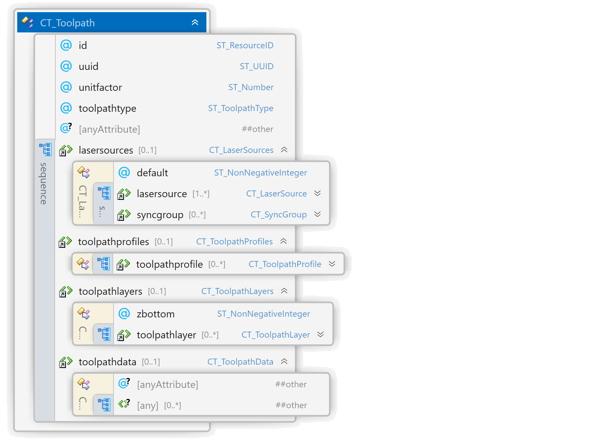

| Name   | Type   | Use   | Default   | Annotation |
| --- | --- | --- | --- | --- |
| id | **ST\_ResourceID** | required |  | Must be a unique resource ID in the model document. |
| uuid | **ST\_UUID** | required |  | Global unique identifier . |
| unitfactor | **ST\_Number** | required |  | Unit scaling factor to be applied to toolpath coordinates. In document units (see 3MF Core Specification). |
| toolpathtype | **ST_ToolpathType** | optional | planar | Type of toolpath described. Possible values are planar, 3axis, 6axis. |

## 4.1 Toolpath profiles

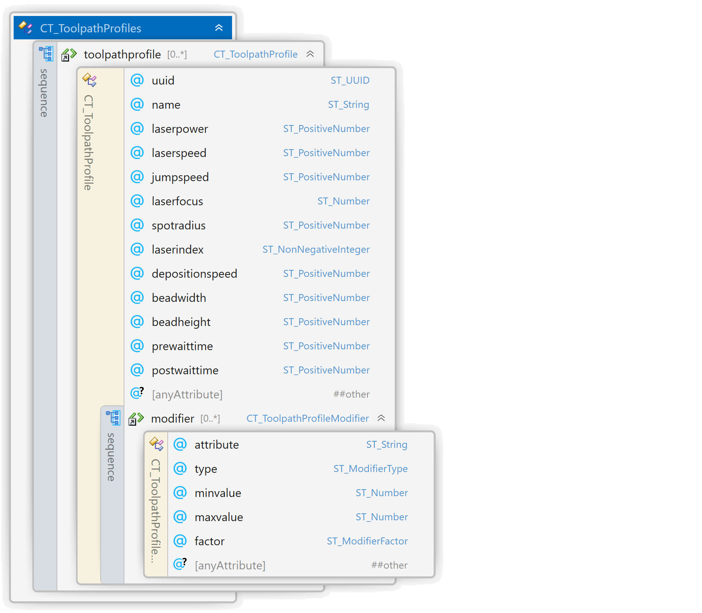

Element **\<tp:toolpathprofiles>**

The \<toolpathprofiles\> element contains list of toolpath profiles that allow a machine process to convert the geometric toolpath definition into low level machine instructions.

Element **\<tp:toolpathprofile>**

| Name   | Type   | Use   | Technology class | Annotation |
| --- | --- | --- | --- | --- |
| uuid | **ST\_UUID** | required |   | Unique identifier for this profile |
| name   | **ST\_String** | required |   | Name for this profile. Must be unique in the toolpath. |
| laserpower | **ST\_PositiveNumber** | optional | lpbf | Laser processes: specifies the power of the laser used, measured in W. |
| laserspeed   | **ST\_PositiveNumber** | optional   | lpbf  | Laser processes: speed at which the projected laser spot moves while marking, measured in mm/s |
| jumpspeed   | **ST\_PositiveNumber** | optional   | lpbf  | Laser processes: speed at which the projected laser spot moves while not marking, measured in mm/s |
| laserfocus   | **ST\_Number** | optional   | lpbf  | Laser processes: Offset for the focal plane of the laser in mm. Positive means above the powder bed. |
| spotradius | **ST\_PositiveNumber** | optional  |  lpbf | Laser processes: Radius of the laser spot in mm. |
| laserindex | **ST\_NonNegativeInteger** | optional  |  lpbf | Laser processes: ID of the laser to be used. MUST NOT be used with overrides. If absent on a segment, this value applies; if that is also absent, the **\<tp\:lasersources>** `default` applies (see [§4.5 Laser Sources](#45-laser-sources)). The resolved index MUST reference a declared **\<tp\:lasersource>** 
| depositionspeed   | **ST\_PositiveNumber** | optional   | deposition | Deposition processes: speed at which the deposition head while extruding, measured in mm/s |
| beadwidth   | **ST\_PositiveNumber** | optional   | deposition | Deposition processes: Width of the deposited material. (approximated cross section) |
| beadheight   | **ST\_PositiveNumber** | optional   | deposition | Deposition processes: Height of the deposited material. (approximated cross section) |
| prewaittime | **ST\_PositiveNumber** | optional  |   | All processes: Additional wait time before the segment in microseconds. If used with overrides, the value of the first segment point MUST BE used. |
| postwaittime | **ST\_PositiveNumber** | optional  |   | All processes: Additional wait time after the segment in microseconds. If used with overrides, the value of the last segment point MUST BE used. |

The \<toolpathprofile\>-elements are used to specify the properties of a laser melting or deposition process. This specification declares the above list of generic values to use. A producer MUST ensure that all necessary profile values are properly declared for a specific application, or as enforced by a profile codec.

In case of a custom profile value, the name MUST be namespaced with a properly defined XML namespace.


## 4.2 Toolpath profile modifiers

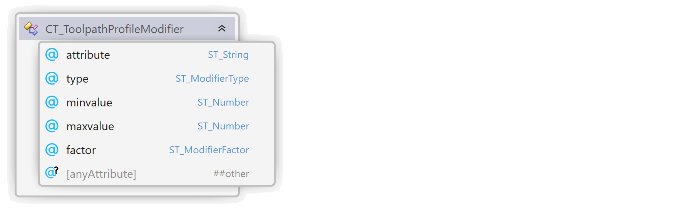

Element **\<tp\:modifier>**

 Modifiers enable granular control without duplicating full profiles.

### Overview and rationale

Base process parameters are carried by **\<tp\:toolpathprofile>** elements, analogous to the parameter sets of many established proprietary machine formats. Modifiers add a controlled way to vary *one* or *several* numeric profile attribute along or across the geometry of a layer — for example, a per-hatch laser-power modulation — **without** embedding raw machine values (such as absolute watts) deep inside the layer data. Embedding such values directly would make it very hard for a machine to verify at load time whether it can actually build the file.

Modifiers therefore introduce an **indirection**. Instead of writing an absolute value on each geometry element, the profile declares a modifier that maps the normalized interval [0, 1] onto a concrete value range [`minvalue`, `maxvalue`]. Each geometry element then carries only a dimensionless factor in [0, 1] (named `e`, `f`, `g`, or `h`). The value applied to an element is:

    value = minvalue + factor × (maxvalue − minvalue)

This design has two important properties:

* **Bounded by construction.** Because factors are confined to [0, 1] and the range is declared once in the profile, a consumer can determine the worst-case value of a modulated attribute (e.g., "no hatch in this build will ever exceed 200 W") from the resource-level index alone, without parsing gigabytes of layer data.
* **Checkable up front.** A consumer can inspect every declared modifier — its target attribute and its `type` — at load time and reject a file it cannot execute (for example, a scan-speed variation its scanner cannot realize) before committing to a build.

Although the mechanism was designed for laser power, it is deliberately attribute-agnostic: the same indirection can modulate any numeric profile attribute that a producer and consumer agree upon.

The `type` attribute selects how many factors an element carries and how they are interpreted:

| `type`      | Factors per element  | Interpretation                                                                                                          |
| ----------- | -------------------- | ----------------------------------------------------------------------------------------------------------------------- |
| `constant`  | one (e.g. `f`)       | A single value for the whole element.                                                                                   |
| `linear`    | two (`f1`, `f2`)     | The value is modulated linearly from the start point (`f1`) to the end point (`f2`) of the element.                     |
| `nonlinear` | two + support points | As `linear`, plus one or more **\<sub>** control points describing a piecewise-linear calibration curve along the element (see [Nonlinear Override Support Points](#nonlinear-override-support-points)). |

#### Example: per-hatch power modulation

A profile carries a nominal `laserpower` of 200 W and declares that it MAY be modulated per hatch via the `f` factor, over the range 0–200 W:

```xml
<tp:toolpathprofile id="10" name="contour-fill" laserpower="200">
  <tp:modifier attribute="laserpower" type="linear" factor="f" minvalue="0" maxvalue="200"/>
</tp:toolpathprofile>
```

In the layer data, individual hatches then carry only a dimensionless `f` factor - never absolute watts:

```xml
<!-- linear ramp along the line: 0 W -> 200 W -->
<hatch x1="0" y1="0" x2="10000" y2="0" f1="0.0" f2="1.0"/>

<!-- a single (less-granular) constant value is also permitted: 100 W across the line -->
<hatch x1="0" y1="100" x2="10000" y2="100" f="0.5"/>
```

A consumer reading only the resource-level index sees `minvalue="0" maxvalue="200"` and can guarantee that no hatch in the build will exceed 200 W - and that `laserpower` is the only modulated attribute — before touching any layer geometry. Under a `linear` modifier an element MAY still carry a single constant `f`; a *less*-granular value is always permitted, and only values *more* granular than the declared `type` are forbidden (see the producer rules below).

### Definition

The **\<tp\:modifier>** element refines a parent **\<tp\:toolpathprofile>** by defining how one numeric profile attribute MAY be overridden *per geometry element* (e.g., per hatch line) or as a (linear or non-linear gradient) on a geometry element. The override is specified by a normalized scalar factor on those elements:

* One scalar factor for a constant override on the element
* Two scalar factors for a linear override on the element. This specifies a linear gradient from the start point to the end point.
* Two scalar factors plus a list of increasing internal support points for a non-linear override on the element. This allows to give a piecewise linear curve on an element with normalized values between 0 and 1 that map to the pointwise override.


A **\<tp\:modifier>**:

* **MUST** be a direct child of **\<tp\:toolpathprofile>**.
* **MUST** reference an attribute that already exists on the parent **\<tp\:toolpathprofile>** (including namespaced attributes).
* **MUST** apply only to attributes with numeric value types (integer or floating-point).
* **MUST** define a closed range \[**minvalue**, **maxvalue**] in the same units as the target attribute.
* **MAY** be declared multiple times in a profile, but **at most one** modifier **MUST** target a given attribute within that profile.
* A profile **MAY** carry up to 4 modifiers, each being identified a specific unique factor type (`"e"`, `"f"`, `"g"`, and `"h"`).
* Attribute modifications on a hatch line are supposed to be be parametrized in _position_ (i.e. geometric), but not in _time_.

### Attributes

| Name      | Type                 | Use      | Default | Annotation                                                                                                                                                              |
| --------- | -------------------- | -------- | ------- | ----------------------------------------------------------------------------------------------------------------------------------------------------------------------- |
| attribute | **ST\_String**       | required |         | Name of the parent profile attribute to override. MAY be namespaced (e.g., `skywriting:mode`). The named attribute **MUST** exist on the parent element and be numeric. |
| type      | **ST\_ModifierType** | required |         | Override rule. One of `constant`, `linear`, `nonlinear`.                                                |
| minvalue  | **ST\_Number**       | required |         | Lower bound of the allowed/targetable value range for the attribute. Units MUST match the attribute. MUST be smaller than maxvalue.  |
| maxvalue  | **ST\_Number**       | required |         | Upper bound of the allowed/targetable value range for the attribute. Units MUST match the attribute. MUST be larger than minvalue. |
| factor    | **ST\_ModifierFactor** | required |         | Factor identifier. Allowed values are `"e"`, `"f"`, `"g"` and `"h"`. These correspond to per-segment override factors defined later in the layer data. |


>**Note:** The 3MF Toolpath specification deliberately restricts the applicable amount of modifiers per profile to four with a prescribed naming scheme. This allows implementers to find efficient data representations without taking too many special cases into consideration.

>**Note:** Many consumer applications do not have the technical capability to support modifiers at all, only on certain profile attributes or only certain modification types like constant overrides. 

The structure as defined in the 3MF specification allows consumers to check before processing the toolpath data: While loading a 3MF Toolpath file, any consumer MUST run a sanity check of all profile modifications in the document, and MUST reject any document that contains any modifier that is not supported by the consumer. 

>**Note:** The intended primary use case of modifiers is to modulate laser properties that are location-dependent (like power ramps or special localized delays), and not influencing the movement trajectory directly (like speed ramps would). This specification allows both use cases, but a producer should be aware that the latter might be rejected by many consumers.

A producer MUST obey the following rules:

- For all override types, a toolpath layer geometry element may contain attributes `"e"`, `"f"`, `"g"`, and `"h"` for the constant case.

- For linear and nonlinear override types, a toolpath layer geometry element may _instead_ contain attributes `"e1"`,`"e2"`, `"f1"`,`"f2"`, `"g1"`, `"g2"`, and `"h1"`, `"h2"` for the start respective end point of the element.

- For non-linear types, an element may _in addition_ contain **\<sub>** child elements to specify a 0-1 parametrized piecewise-linear curve on the element (see below).

- No element may contain an override factor data that is more granular than its specified modifier type.

### Nonlinear Override Support Points

For modifiers with `type="nonlinear"`, geometry elements (`<hatch>` or `<point>`) MAY contain one or more **\<sub>** child elements. Each **\<sub>** element defines a support point on a piecewise-linear interpolation curve along the geometry element.

**Element \<sub>**

The **\<sub>** element specifies modifier factor values at a specific parametric position along its parent geometry element. The parametric position is normalized to the range \[0,&nbsp;1\], where 0 corresponds to the start of the element and 1 corresponds to the end.

Together with the modifier factor values on the parent element (given as `e1`/`e2`, `f1`/`f2`, `g1`/`g2`, `h1`/`h2`), the **\<sub>** elements define a piecewise-linear curve. Interpolation between the start-point values, the support points, and the end-point values MUST be linear within each segment of the piecewise curve.

| Name | Type                 | Use      | Annotation                                                                                                                     |
| ---- | -------------------- | -------- | ------------------------------------------------------------------------------------------------------------------------------ |
| t    | **ST\_SubParameter** | required | Parametric position along the parent element. MUST be strictly greater than 0 and strictly less than 1.                        |
| e    | **ST\_ModifierScale** | optional | Override factor value for the `e` modifier at parametric position `t`. MUST be between 0 and 1.                                |
| f    | **ST\_ModifierScale** | optional | Override factor value for the `f` modifier at parametric position `t`. MUST be between 0 and 1.                                |
| g    | **ST\_ModifierScale** | optional | Override factor value for the `g` modifier at parametric position `t`. MUST be between 0 and 1.                                |
| h    | **ST\_ModifierScale** | optional | Override factor value for the `h` modifier at parametric position `t`. MUST be between 0 and 1.                                |

**Producer rules:**

* Each **\<sub>** element MUST have a `t` attribute.
* At least one of `e`, `f`, `g`, `h` MUST be present on each **\<sub>** element.
* If multiple **\<sub>** elements are present, their `t` values MUST be strictly increasing in document order.
* **\<sub>** elements MUST only be present when the parent element also carries linear-style factor attributes (`e1`/`e2`, `f1`/`f2`, `g1`/`g2`, `h1`/`h2`).
* **\<sub>** elements MUST NOT appear on geometry elements whose associated profile modifier has `type` other than `nonlinear`.

**Consumer rules:**

* Consumers MUST interpolate linearly between consecutive support points (including the start and end values from the parent element).
* If a **\<sub>** element is missing a factor attribute that the parent element provides (e.g., the parent has `f1`/`f2` but the **\<sub>** omits `f`), the consumer MUST linearly interpolate that factor as if the **\<sub>** were not present for that factor.

**Interpolation model:**

Given a parent element with start value `f1`, end value `f2`, and _n_ **\<sub>** elements with positions t&#x2081;,&nbsp;t&#x2082;,&nbsp;&hellip;,&nbsp;t&#x2099; and values v&#x2081;,&nbsp;v&#x2082;,&nbsp;&hellip;,&nbsp;v&#x2099;, the effective value at parametric position _p_ (0&nbsp;&le;&nbsp;p&nbsp;&le;&nbsp;1) is obtained by piecewise-linear interpolation over the sequence of control points:

(0,&nbsp;f1),&ensp;(t&#x2081;,&nbsp;v&#x2081;),&ensp;(t&#x2082;,&nbsp;v&#x2082;),&ensp;&hellip;,&ensp;(t&#x2099;,&nbsp;v&#x2099;),&ensp;(1,&nbsp;f2)

#### Example (informative)

A hatch with a nonlinear `f` modifier that ramps up steeply over the first 20%, then gently tapers off over the remainder:

```xml
<hatch x1="0" y1="0" x2="10000" y2="0" f1="0.0" f2="0.5">
  <sub t="0.2" f="0.8"/>
  <sub t="0.8" f="0.6"/>
</hatch>
```

This produces the piecewise-linear curve through the control points (0,&nbsp;0.0), (0.2,&nbsp;0.8), (0.8,&nbsp;0.6), (1,&nbsp;0.5): linear ramp 0.0&nbsp;&rarr;&nbsp;0.8 over \[0,&nbsp;0.2\], linear decrease 0.8&nbsp;&rarr;&nbsp;0.6 over \[0.2,&nbsp;0.8\], and linear decrease 0.6&nbsp;&rarr;&nbsp;0.5 over \[0.8,&nbsp;1\].

## 4.3 Toolpath layers

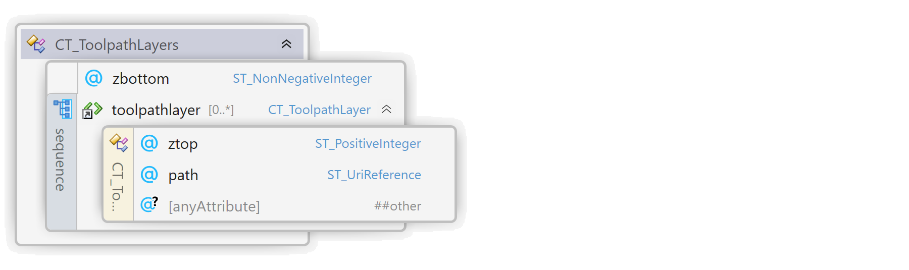

Element **\<tp:toolpathlayers>**

The \<toolpathlayers\> element contains a list of references to OPC packages that contain the specific layers.

| Name   | Type   | Use   | Default   | Annotation |
| --- | --- | --- | --- | --- |
| zbottom | **ST\_NonNegativeInteger** | required, if toolpathtype is "planar" |  0 | Bottom Z Value of the first layer. Not applicable for non-planar toolpaths. |


Element **\<tp:toolpathlayer>**

| Name   | Type   | Use   | Default   | Annotation |
| --- | --- | --- | --- | --- |
| ztop | **ST\_PositiveInteger** | required, if toolpathtype is "planar" |   | Not applicable for non-planar toolpaths. MUST be larger or equal than zbottom, as well as the ztop of the previous layer. If a layer has zero thickness, it is a consumer decision to add a recoat cycle between the layers. Depending on the use case, there SHOULD be a custom metadata instruction to clarify the indented behavior.  |
| path | **ST\_UriReference** | required |   | OPC part name (URI) of the layer XML part that holds the geometry for this layer. The referenced part MUST also be the target of an OPC relationship of type `http://schemas.3mf.io/3dmanufacturing/toolpath/2026/03/layer` declared from the **\<tp\:toolpathresource>** part (see [3.2 Relationships and Binding](#32-relationships-and-binding)). Consumers MUST use this attribute, together with the OPC relationship, to locate and load the layer part. |


## 4.4 Custom Toolpath Metadata

Element **\<tp\:toolpathdata>**

The **\<tp\:toolpathdata>** container provides a safe, vendor-neutral place to embed *producer-generated metadata* about a toolpath. It is intended for provenance, slicer settings snapshots, QA annotations, simulation results, or workflow tags that do **not** alter the normative execution semantics of the toolpath unless the extension is marked as required.

Child elements MUST be qualified with a namespace that is **not** any official 3MF Extension namespace (like core or production) . Producers MUST declare such namespaces at the **\<model>** element.

Within **\<tp\:toolpathdata>**, each vendor (or workflow) **MAY** define an arbitrary, well-formed XML subtree (elements, attributes, text). Sibling subtrees from different namespaces may coexist.

> **Note:** This specification deliberately treats the content model as open to maximize interoperability. The toolpathdata subtree is metadata only; its interpretation is outside the scope of this extension unless separately standardized by another extension and marked as required.

#### Security and parsing requirements

To keep 3MF packages self-contained and deterministic, consumers and producers MUST observe the following for all content under **\<tp\:toolpathdata>**:

* **No externalization.** Content MUST NOT cause dereferencing of external resources. This includes DTDs, external entities, XInclude, external schemas fetched at parse time, processing instructions with retrieval semantics, or URI/IRI attributes intended to be fetched at load time.
* **No CDATA.** Producers MUST NOT use `<![CDATA[ ... ]]>` sections; plain character data MUST be used instead.
* **No binary payloads.** Large binary data (e.g., images, logs) MUST NOT be embedded. If binary data is essential, it MAY be stored as a separate OPC part with an explicit relationship from **\<tp\:toolpathresource>** (outside of **\<tp\:toolpathdata>**) per OPC rules.
* **Well-formedness only.** Content MUST be well-formed XML. Validation of vendor schemas is optional; consumers MAY process child content with lax validation.
* **Determinism.** Child content MUST NOT instruct the consumer to execute scripts or transform/modify the package at load time.

#### Producer requirements

* Producers MAY add any number of namespaced child elements under **\<tp\:toolpathdata>**.
* If metadata is _essential_ to fabrication correctness, producers MUST expose it through a standardized extension or profile codec and MUST mark that extension as *required* at the **\<model>** level. If a metadata namespace is not required, the associated custom metadata alone MUST NOT be relied upon to change execution.
* Producers SHOULD keep metadata concise and human-auditable (e.g., key–value elements or small trees), and SHOULD document their namespaces in a proper maintained specification document..

#### Consumer requirements

* Consumers that do not recognize a child namespace MUST ignore it without error and MUST preserve it on read/modify/write round-trips.
* Consumers MUST enforce the prohibitions listed above. If violated, the document MUST be rejected.
* Consumers MAY surface the metadata to users (e.g., as read-only key–value views) and MAY implement vendor-specific enrichments where available.


#### Example (informative)

```xml
<tp:toolpathresource id="1" uuid="92f90fa0-e2cc-4cb0-a56b-aa4fd2f51868" unitfactor="0.001">
  <!-- ... lasersources, profiles and layers ... -->
  <tp:toolpathdata>
    <mycompany:testmetadata>
      <mycompany:toolpathinfo used_compensation_mode="simple" machine_model="MySLM7000"/>
    </mycompany:testmetadata>
  </tp:toolpathdata>
</tp:toolpathresource>
```

> **Note:** The example shows a single vendor block. Multiple independent blocks (e.g., `<qa:report>…</qa:report>`, `<sim:results>…</sim:results>`) may be included side-by-side under **\<tp\:toolpathdata>**.

## 4.5 Laser Sources

Multi-laser LPBF systems expose several independent scan fields. A consumer MUST be able to determine how many lasers a toolpath targets, each laser's addressable field, and how cross-laser synchronization is expressed **without reading layer data**. For that reason, laser capability is declared at the **\<tp\:toolpathresource>** level, not inside individual layer parts.

Element **\<tp\:lasersources>** is an optional child of **\<tp\:toolpathresource>**. Producers SHOULD place it as the **first** child of **\<tp\:toolpathresource>** so consumers can read laser metadata before profiles or layer references.

Element **\<tp\:lasersources>**

| Name    | Type                    | Use      | Default | Annotation |
| ------- | ----------------------- | -------- | ------- | ---------- |
| default | **ST\_NonNegativeInteger** | optional |         | Laser index used when a profile or segment omits `laserindex`. If present, MUST reference the `index` of a declared **\<tp\:lasersource>**. |

**Children**

* One or more **\<tp\:lasersource>** (MUST be ≥ 1 when **\<tp\:lasersources>** is present).
* Zero or more **\<tp\:syncgroup>**.

Element **\<tp\:lasersource>**

Declares one laser scan field available to this toolpath.

| Name     | Type            | Use      | Annotation |
| -------- | --------------- | -------- | ---------- |
| index    | **ST\_NonNegativeInteger** | required | Unique identifier for this laser within the toolpath. Referenced by `laserindex` on profiles and segments. MUST be unique among all **\<tp\:lasersource>** siblings. |
| name     | **ST\_String**  | required | Human-readable label (e.g., `Laser 1`). |
| minx     | **ST\_Integer** | optional | Minimum X coordinate of the addressable scan field, in toolpath units (integer device units; multiply by the resource `unitfactor` to obtain millimeters), in the global build-plane coordinate system. Part of the optional bounds group (see Conformance). |
| maxx     | **ST\_Integer** | optional | Maximum X coordinate of the addressable scan field, in toolpath units. MUST be greater than or equal to `minx` when present. Part of the optional bounds group. |
| miny     | **ST\_Integer** | optional | Minimum Y coordinate of the addressable scan field, in toolpath units. Part of the optional bounds group. |
| maxy     | **ST\_Integer** | optional | Maximum Y coordinate of the addressable scan field, in toolpath units. MUST be greater than or equal to `miny` when present. Part of the optional bounds group. |
| centerx  | **ST\_Integer** | optional | X coordinate of the scan-field optical center or home position, in toolpath units. Part of the optional center pair (see Conformance). |
| centery  | **ST\_Integer** | optional | Y coordinate of the scan-field optical center or home position, in toolpath units. Part of the optional center pair. |
| cornerradius | **ST\_PositiveInteger** | optional | Radius used to round the four corners of the rectangular scan field, in toolpath units. When present, the addressable field is the rectangle \[`minx`,&nbsp;`maxx`\]&times;\[`miny`,&nbsp;`maxy`\] with each corner rounded by this radius. A value equal to half the shorter side yields a fully rounded field (a circle when the field is square). Only valid when the bounds group is present, and independent of the optical center (see Conformance). |

Element **\<tp\:syncgroup>**

Declares a named set of lasers that participate in a synchronization barrier. Segments reference a sync group through the `lasersync` attribute (see [§1.2.1 Parallel Execution and Laser Synchronization](#121-parallel-execution-and-laser-synchronization)).

| Name   | Type            | Use      | Annotation |
| ------ | --------------- | -------- | ---------- |
| id     | **ST\_PositiveInteger** | required | Unique identifier for this sync group within **\<tp\:lasersources>**. Referenced by `lasersync` on segments. MUST be unique among all **\<tp\:syncgroup>** siblings. |
| lasers | **ST\_String**  | required | Space-separated list of **ST\_NonNegativeInteger** values. Each entry MUST be the `index` of a declared **\<tp\:lasersource>**. |

#### Conformance

* **\<tp\:lasersources>** is **optional**. If it is absent, the toolpath is treated as a single-laser document; `laserindex` SHOULD be omitted or set to `0`.
* A producer that targets a **multi-laser** system — i.e., uses more than one distinct `laserindex` value, or uses `lasersync` on any segment — **MUST** declare **\<tp\:lasersources>** and enumerate every laser index referenced anywhere in the toolpath.
* When **\<tp\:lasersources>** is present:
  * Every `laserindex` on a **\<tp\:toolpathprofile>** or **\<segment>** MUST resolve to a declared **\<tp\:lasersource>** `index`, or the consumer **MUST** reject the document.
  * If `default` is present, it MUST resolve to a declared **\<tp\:lasersource>** `index`, or the consumer **MUST** reject the document.
  * Every entry in a **\<tp\:syncgroup>** `lasers` list MUST resolve to a declared **\<tp\:lasersource>** `index`, or the consumer **MUST** reject the document.
  * Every `lasersync` on a **\<segment>** MUST resolve to a declared **\<tp\:syncgroup>** `id`, or the consumer **MUST** reject the layer.
* `index` values among **\<tp\:lasersource>** elements MUST be unique.
* `id` values among **\<tp\:syncgroup>** elements MUST be unique.
* The scan-field bounds form an **all-or-nothing group**: a **\<tp\:lasersource>** MUST either omit all of `minx`, `maxx`, `miny`, and `maxy`, or provide all four. If at least one of these attributes is present and any is missing, the consumer **MUST** reject the document. When the group is present, `maxx` MUST be greater than or equal to `minx`, and `maxy` MUST be greater than or equal to `miny`.
* The optical center forms an **all-or-nothing pair**: a **\<tp\:lasersource>** MUST either omit both `centerx` and `centery`, or provide both. If exactly one is present, the consumer **MUST** reject the document.
* The `cornerradius` attribute is **optional** and describes a rounded scan field. It MUST only be present when the scan-field bounds group is present; if `cornerradius` is present while any of `minx`, `maxx`, `miny`, `maxy` is absent, the consumer **MUST** reject the document. When present, `cornerradius` MUST be greater than 0 and MUST be less than or equal to half of the shorter field dimension — i.e. `cornerradius` ≤ min(`maxx` − `minx`, `maxy` − `miny`) ÷ 2 — otherwise the consumer **MUST** reject the document. A `cornerradius` equal to this maximum produces a fully rounded field (a circle when the field is square, a stadium shape when it is rectangular). `cornerradius` is independent of the optical center (`centerx`/`centery`).

#### Example (informative)

```xml
<tp:toolpathresource id="1" uuid="92f90fa0-e2cc-4cb0-a56b-aa4fd2f51868" unitfactor="0.001">
  <tp:lasersources default="1">
    <tp:lasersource index="1" name="Laser 1" minx="0" maxx="100000" miny="0" maxy="100000" centerx="50000" centery="50000" cornerradius="50000" /> <!-- circular field -->
    <tp:lasersource index="2" name="Laser 2" minx="0" maxx="100000" miny="0" maxy="100000" centerx="50000" centery="50000" cornerradius="20000" /> <!-- rounded rectangle -->
    <tp:lasersource index="3" name="Laser 3" minx="0" maxx="100000" miny="0" maxy="100000" centerx="50000" centery="50000" />
    <tp:lasersource index="4" name="Laser 4" minx="0" maxx="100000" miny="0" maxy="100000" centerx="50000" centery="50000" />
    <tp:syncgroup id="1" lasers="1 2 3 4" />
  </tp:lasersources>
  <!-- ... profiles and layers ... -->
</tp:toolpathresource>
```

A segment that waits for all four lasers before exposing:

```xml
<segment type="hatch" profileid="1" partid="1" laserindex="1" lasersync="1">
  <!-- hatch geometry ... -->
</segment>
```


## 4.6 Selecting a toolpath for the build

A 3MF package MAY contain more than one **\<tp\:toolpathresource>** (for example, alternative process strategies for the same geometry). To make the producer's intent explicit, the core **\<build>** element MAY carry the optional `tp:toolpathid` attribute defined by this extension.

| Name | Type | Use | Annotation |
| ---- | ---- | --- | ---------- |
| toolpathid | **ST\_ResourceID** | optional | Model resource `id` of the **\<tp\:toolpathresource>** that SHOULD be used to fabricate this build. The referenced resource MUST be a **\<tp\:toolpathresource>** present in the same model document. |

The attribute is written with the toolpath namespace prefix on the core element, e.g.:

```xml
<build tp:toolpathid="1">
  <item objectid="2" transform="1 0 0 0 1 0 0 0 1 0 0 0" />
</build>
```

#### Conformance

* `tp:toolpathid` is **optional**. If it is absent and the package contains exactly one **\<tp\:toolpathresource>**, a consumer SHOULD use that resource. If it is absent and several toolpath resources are present, the choice is consumer-defined.
* If `tp:toolpathid` is present, it MUST reference the `id` of a **\<tp\:toolpathresource>** in the same model document, or the consumer **MUST** reject the document.
* The attribute references the toolpath resource by its integer resource `id`, consistent with how other core elements reference resources.


# Part II. Layer Data

This Part defines the representation of a toolpath layer and the rules for interpreting it. Unless noted otherwise, all coordinates are **integer device units** that MUST be converted to millimeters by multiplying with the parent **\<tp\:toolpathresource>**’s `unitfactor` (see Part I). Element and attribute names are case-sensitive.

Execution order of geometry MUST be the document order. Consumers MUST NOT reorder segments, 

# Chapter 1 - Layer ASCII XML Structure

Element **\<layer>**

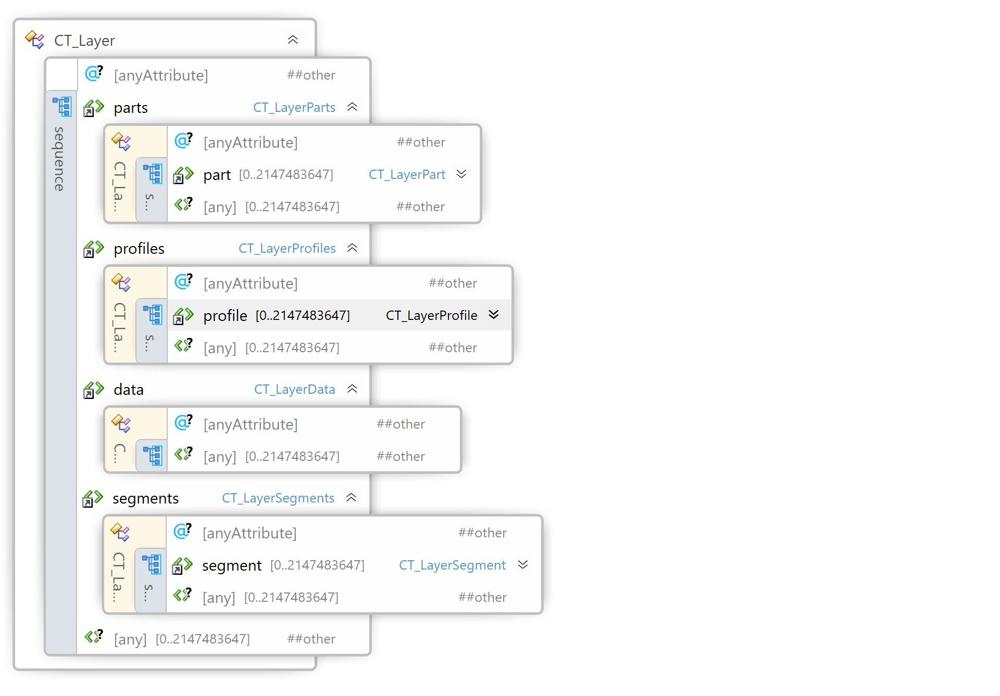

* **Namespace (default):** `http://schemas.3mf.io/3dmanufacturing/toolpath/2026/03`
* **Other namespaces:** Producers MAY declare additional namespaces for vendor metadata (e.g., `mycompany:`) or process attributes (e.g., `skywriting:`). A separate `bin:` namespace is reserved for a Binary Encoding extension.

Consumers MUST ignore unrecognized elements and attributes in namespaces other than the above default, except where this Part explicitly requires rejection.

## 1.1. References to Parts and Profiles

### 1.1.1 Parts

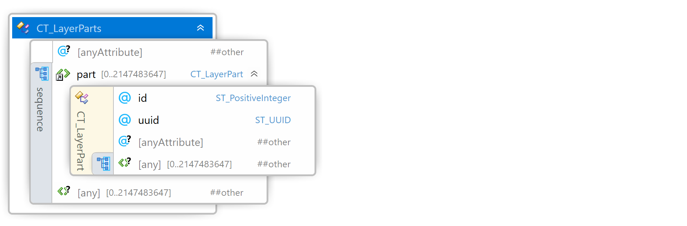

**Element \<parts>**

Provides local identifiers for build items referenced by geometry.

**Child element \<part>**

| Name | Type                    | Use      | Annotation                                                                     |
| ---- | ----------------------- | -------- | ------------------------------------------------------------------------------ |
| id   | **ST\_PositiveInteger** | required | Identifier unique **within the layer**.                                        |
| uuid | **ST\_UUID**            | required | UUID of the referenced build item present in the package. |

Segments MUST reference a part via an integer `partid`. If any segment does refer to a `partid` not specified the same layer, the consumer **MUST** reject the layer.

> **Note:** The `partid` is purposefully not guaranteed to be globally unique, to ease implementation.

### 1.1.2 Profiles

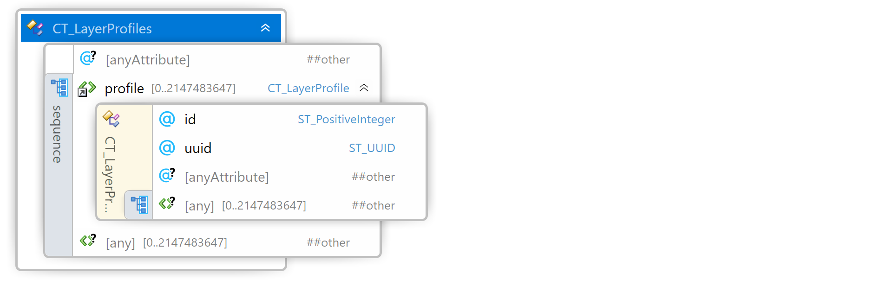

**Element \<profiles>**

Maps local identifiers to Toolpath Profiles defined in the parent **\<tp\:toolpathresource>**.

**Child element \<profile>**

| Name | Type                    | Use      | Annotation                                                                                             |
| ---- | ----------------------- | -------- | ------------------------------------------------------------------------------------------------------ |
| id   | **ST\_PositiveInteger** | required | Identifier unique **within the layer**.                                                                |
| uuid | **ST\_UUID**            | required | UUID of a **\<tp\:toolpathprofile>** declared under the parent resource’s **\<tp\:toolpathprofiles>**. |

Each segment MUST specify `profileid`. If any segment does refer to a `profileid` not specified the same layer, the consumer **MUST** reject the layer.

### 1.1.3 Custom Layer Metadata

**Element \<data>**

The optional **\<data>** element is the per-layer counterpart of the resource-level **\<tp\:toolpathdata>** (see [§4.4](#44-custom-toolpath-metadata)). It provides a vendor-neutral container for producer-generated metadata scoped to a single layer — for example, per-layer quality-assurance annotations, sensor snapshots, or workflow tags — that does not change the normative execution semantics of the layer.

When present, **\<data>** appears after **\<profiles>** and before **\<segments>** within the layer. The same content rules as for **\<tp\:toolpathdata>** apply:

* Child elements **MUST** be qualified with a namespace that is not any official 3MF Extension namespace, and producers **MUST** declare such namespaces on the enclosing element.
* Content **MUST** be well-formed XML and **MUST NOT** dereference external resources, use CDATA sections, embed binary payloads, or instruct the consumer to execute scripts or transform the package at load time.
* Consumers that do not recognize a child namespace **MUST** ignore it without error and **SHOULD** preserve it across read/modify/write round-trips.

---

## 1.2. Segment Data

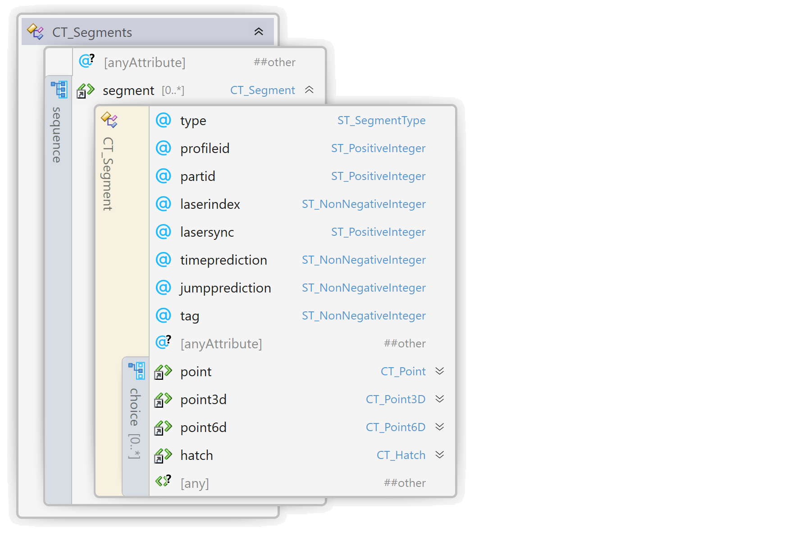

**Element \<segments>**

Contains one or more **\<segment>** elements.

A **segment** is the generic container node for a single unit of toolpath content. Every **\<segment>** carries the common attributes below (geometry `type`, profile and part references, laser assignment, and timing hints) and derives into exactly one specialized geometry form that supplies the concrete point or line data — currently a `loop`, `polyline`, or `hatch` (planar), or a `polyline3d` / `polyline6d` (non-planar). Segments are the atomic building blocks of a layer: a layer's marking instructions are expressed entirely as an ordered list of segments.

> **Note:** Additional geometry types (for example, arcs and Bézier curves) are anticipated in future revisions of this extension. They were intentionally deferred beyond the first release to keep the initial geometry set small and broadly implementable. A consumer MUST reject a layer that contains a segment `type` it does not recognize.

All segments are listed in document order within **\<segments>**. Segments that share the same `laserindex` MUST be executed sequentially on that laser. Segments assigned to different `laserindex` values MAY be executed in parallel. Cross-laser ordering is unconstrained except at explicit synchronization barriers; see [§1.2.2 Parallel Execution and Laser Synchronization](#122-parallel-execution-and-laser-synchronization).


**Element \<segment>**


| Name      | Type                       | Use      | Default | Annotation                                                            |
| --------- | -------------------------- | -------- | ------- | --------------------------------------------------------------------- |
| type      | **ST\_String**             | required |         | One of `loop`, `polyline`, `hatch` (planar), or `polyline3d`, `polyline6d` (non-planar). |
| profileid | **ST\_PositiveInteger**    | required |         | Resolves via **\<profiles>** ([§1.1.2](#112-profiles)).              |
| partid    | **ST\_PositiveInteger**    | optional |         | Resolves via **\<parts>** ([§1.1.1](#111-parts)).                    |
| laserindex | **ST\_NonNegativeInteger** | optional |         | Laser processes: overrides the `laserindex` of the referenced profile for this segment. If present, a consumer MUST use this value instead of the profile's `laserindex` to select the laser unit. If absent, the profile's `laserindex` applies; if that is also absent, the **\<tp\:lasersources>** `default` applies (see [§4.5 Laser Sources](#45-laser-sources)). The resolved index MUST reference a declared **\<tp\:lasersource>** when **\<tp\:lasersources>** is present. |
| lasersync  | **ST\_PositiveInteger**   | optional |         | References the `id` of a **\<tp\:syncgroup>** declared under the parent **\<tp\:toolpathresource>** (see [§4.5 Laser Sources](#45-laser-sources)). Before this segment begins exposing, the consumer MUST wait until every laser listed in the referenced sync group has finished all exposures issued earlier in the layer on their respective tracks. If absent, no cross-laser barrier is imposed at this segment. MUST resolve to a declared sync group or the consumer **MUST** reject the layer. |
| timeprediction | **ST\_NonNegativeInteger** | optional |     | Producer-estimated execution time of this segment, in microseconds. This is the time the machine is expected to spend marking (exposing) the geometry contained in this segment. Consumers MAY use this value for progress estimation, scheduling, or validation, but MUST NOT rely on it for safety-critical timing. |
| jumpprediction | **ST\_NonNegativeInteger** | optional |     | Producer-estimated jump time to reach the start of this segment from the end of the preceding segment (or the machine origin for the first segment in a layer), in microseconds. This accounts for non-marking repositioning. Consumers MAY use this value for progress estimation, scheduling, or validation, but MUST NOT rely on it for safety-critical timing. |
| tag       | **ST\_NonNegativeInteger** | optional |         | Producer-defined grouping or ordering hint. Consumers **MAY** ignore. |

A segment node MAY include arbitrary attributes, if they are properly namespaced. A consumer MUST understand all used namespaces of a layer XML, or reject the layer.

### 1.2.1 Children of Segment

The _type_ attribute of a segment determines its acceptable XML child nodes. 

**Child \<point> (planar)**

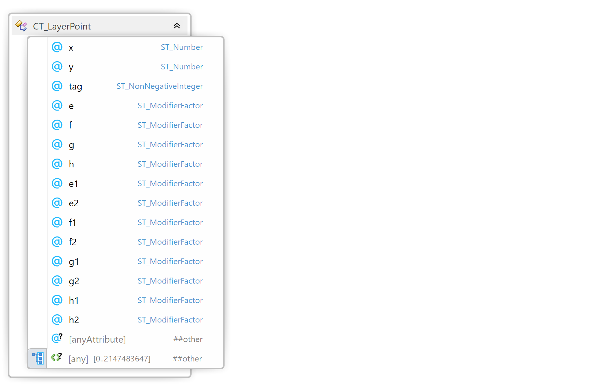

For type `loop` and `polyline`, the segment MUST contain a non-empty list planar points.

| Name      | Type            | Use      | Annotation                                                                                 |
| --------- | --------------- | -------- | ------------------------------------------------------------------------------------------ |
| x         | **ST\_Integer** | required | X coordinate (device units).                                                               |
| y         | **ST\_Integer** | required | Y coordinate (device units).                                                               |
| tag       | **ST\_NonNegativeInteger** | optional | Producer-defined marker for the line that the point closes. Tags have no direct meaning, but MAY be referenced from Metadata. |
| e         | **ST\_ModifierScale** | optional | Scale factor for a constant `e` modifier for the line that the point closes. MUST be a number value between 0 and 1. MUST NOT be given, if `e1` or `e2` are present. |
| f         | **ST\_ModifierScale** | optional | Scale factor for a constant `f` modifier for the line that the point closes. MUST be a number value between 0 and 1. MUST NOT be given, if `f1` or `f2` are present. |
| g         | **ST\_ModifierScale** | optional | Scale factor for a constant `g` modifier for the line that the point closes. MUST be a number value between 0 and 1. MUST NOT be given, if `g1` or `g2` are present. |
| h         | **ST\_ModifierScale** | optional | Scale factor for a constant `h` modifier for the line that the point closes. MUST be a number value between 0 and 1. MUST NOT be given, if `h1` or `h2` are present. |
| e1, e2         | **ST\_ModifierScale** | optional | First and second scale factors for a linear `e` modifier for the line that the point closes. MUST be a number value between 0 and 1.  MUST NOT be given, if `e` is present. If `e1` is given, ´e2´ MUST be present, and vice versa. |
| f1, f2         | **ST\_ModifierScale** | optional | First and second scale factors for a linear `f` modifier for the line that the point closes. MUST be a number value between 0 and 1.  MUST NOT be given, if `f` is present. If `f1` is given, ´f2´ MUST be present, and vice versa. |
| g1, g2         | **ST\_ModifierScale** | optional | First and second scale factors for a linear `g` modifier for the line that the point closes. MUST be a number value between 0 and 1.  MUST NOT be given, if `g` is present. If `g1` is given, ´g2´ MUST be present, and vice versa. |
| h1, h2         | **ST\_ModifierScale** | optional | First and second scale factors for a linear `h` modifier for the line that the point closes. MUST be a number value between 0 and 1.  MUST NOT be given, if `h` is present. If `h1` is given, ´h2´ MUST be present, and vice versa. |


**Child \<hatch> (planar)**

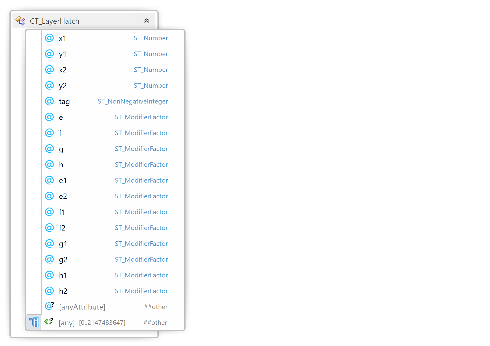

For type `hatch`, the segment MUST contain a non-empty list planar hatches.

| Name      | Type            | Use      | Annotation                                                                                 |
| --------- | --------------- | -------- | ------------------------------------------------------------------------------------------ |
| x1         | **ST\_Integer** | required | X coordinate of the first hatch point (device units).                                                               |
| y1         | **ST\_Integer** | required | Y coordinate of the first hatch point (device units).                                                               |
| x2         | **ST\_Integer** | required | X coordinate of the second hatch point (device units).                                                               |
| y2         | **ST\_Integer** | required | Y coordinate of the second hatch point (device units).                                                               |
| tag       | **ST\_NonNegativeInteger** | optional | Producer-defined marker for the hatch line. Tags have no direct meaning, but MAY be referenced from Metadata. |
| e         | **ST\_ModifierScale** | optional | Scale factor for a constant `e` modifier for the hatch line. MUST be a number value between 0 and 1. MUST NOT be given, if `e1` or `e2` are present. |
| f         | **ST\_ModifierScale** | optional | Scale factor for a constant `f` modifier for the hatch line. MUST be a number value between 0 and 1. MUST NOT be given, if `f1` or `f2` are present. |
| g         | **ST\_ModifierScale** | optional | Scale factor for a constant `g` modifier for the hatch line. MUST be a number value between 0 and 1. MUST NOT be given, if `g1` or `g2` are present. |
| h         | **ST\_ModifierScale** | optional | Scale factor for a constant `h` modifier for the hatch line. MUST be a number value between 0 and 1. MUST NOT be given, if `h1` or `h2` are present. |
| e1, e2         | **ST\_ModifierScale** | optional | First and second scale factors for a linear `e` modifier from the start to the end point of the hatch. MUST be a number value between 0 and 1.  MUST NOT be given, if `e` is present. If `e1` is given, `e2` MUST be present, and vice versa. |
| f1, f2         | **ST\_ModifierScale** | optional | First and second scale factors for a linear `f` modifier from the start to the end point of the hatch. MUST be a number value between 0 and 1.  MUST NOT be given, if `f` is present. If `f1` is given, `f2` MUST be present, and vice versa. |
| g1, g2         | **ST\_ModifierScale** | optional | First and second scale factors for a linear `g` modifier from the start to the end point of the hatch. MUST be a number value between 0 and 1.  MUST NOT be given, if `g` is present. If `g1` is given, `g2` MUST be present, and vice versa. |
| h1, h2         | **ST\_ModifierScale** | optional | First and second scale factors for a linear `h` modifier from the start to the end point of the hatch. MUST be a number value between 0 and 1.  MUST NOT be given, if `h` is present. If `h1` is given, `h2` MUST be present, and vice versa. |


**Child \<point3d> (3axis)**

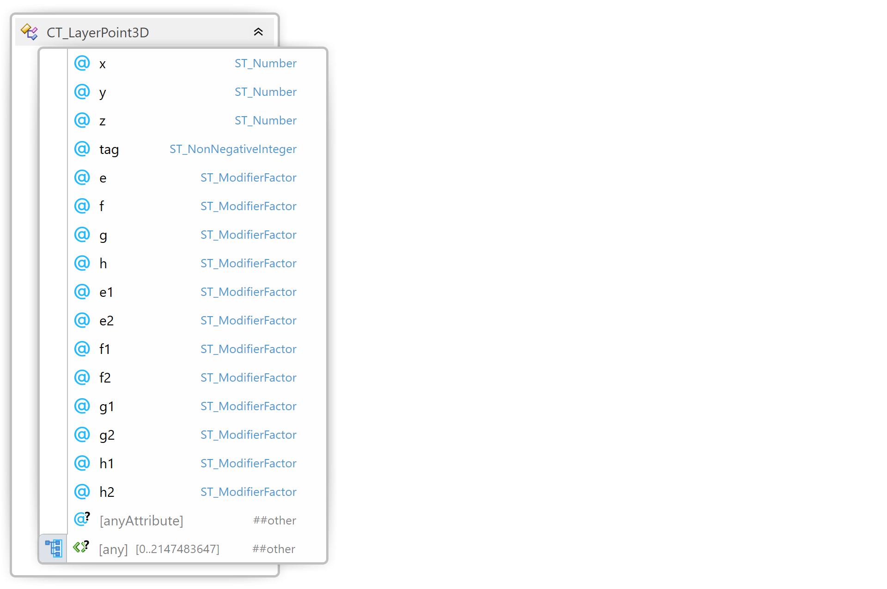

For type `polyline3d`, the segment MUST contain a non-empty list 3axis points.

| Name      | Type            | Use      | Annotation                                                                                 |
| --------- | --------------- | -------- | ------------------------------------------------------------------------------------------ |
| x         | **ST\_Integer** | required | X coordinate (device units).                                                               |
| y         | **ST\_Integer** | required | Y coordinate (device units).                                                               |
| z         | **ST\_Integer** | required | Z coordinate (device units).                                                               |
| tag       | **ST\_NonNegativeInteger** | optional | Producer-defined marker for the line that the point closes. Tags have no direct meaning, but MAY be referenced from Metadata. |
| e         | **ST\_ModifierScale** | optional | Scale factor for a constant `e` modifier for the line that the point closes. MUST be a number value between 0 and 1. MUST NOT be given, if `e1` or `e2` are present. |
| f         | **ST\_ModifierScale** | optional | Scale factor for a constant `f` modifier for the line that the point closes. MUST be a number value between 0 and 1. MUST NOT be given, if `f1` or `f2` are present. |
| g         | **ST\_ModifierScale** | optional | Scale factor for a constant `g` modifier for the line that the point closes. MUST be a number value between 0 and 1. MUST NOT be given, if `g1` or `g2` are present. |
| h         | **ST\_ModifierScale** | optional | Scale factor for a constant `h` modifier for the line that the point closes. MUST be a number value between 0 and 1. MUST NOT be given, if `h1` or `h2` are present. |
| e1, e2         | **ST\_ModifierScale** | optional | First and second scale factors for a linear `e` modifier for the line that the point closes. MUST be a number value between 0 and 1.  MUST NOT be given, if `e` is present. If `e1` is given, ´e2´ MUST be present, and vice versa. |
| f1, f2         | **ST\_ModifierScale** | optional | First and second scale factors for a linear `f` modifier for the line that the point closes. MUST be a number value between 0 and 1.  MUST NOT be given, if `f` is present. If `f1` is given, ´f2´ MUST be present, and vice versa. |
| g1, g2         | **ST\_ModifierScale** | optional | First and second scale factors for a linear `g` modifier for the line that the point closes. MUST be a number value between 0 and 1.  MUST NOT be given, if `g` is present. If `g1` is given, ´g2´ MUST be present, and vice versa. |
| h1, h2         | **ST\_ModifierScale** | optional | First and second scale factors for a linear `h` modifier for the line that the point closes. MUST be a number value between 0 and 1.  MUST NOT be given, if `h` is present. If `h1` is given, ´h2´ MUST be present, and vice versa. |


**Child \<point6d> (6axis)**

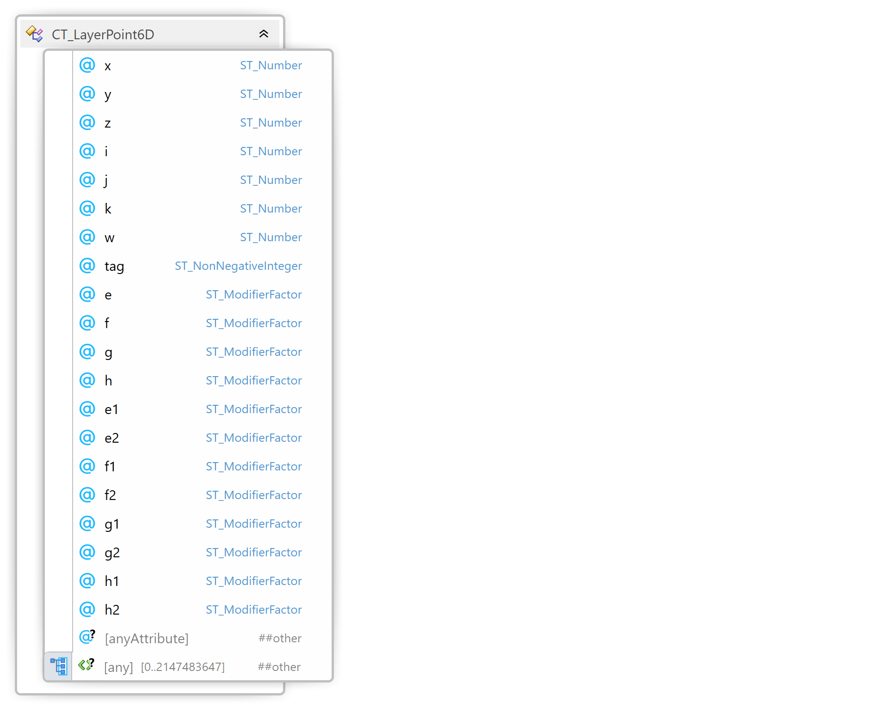

For type `polyline6d`, the segment MUST contain a non-empty list 6axis points.

| Name      | Type            | Use      | Annotation                                                                                 |
| --------- | --------------- | -------- | ------------------------------------------------------------------------------------------ |
| x         | **ST\_Integer** | required | X coordinate (device units).                                                               |
| y         | **ST\_Integer** | required | Y coordinate (device units).                                                               |
| z         | **ST\_Integer** | required | Z coordinate (device units).                                                               |
| i         | **ST\_Number** | required | Quaternion `i` value of a reference frame at the point.                                                               |
| j         | **ST\_Number** | required | Quaternion `j` value of a reference frame at the point.                                                               |
| k         | **ST\_Number** | required | Quaternion `k` value of a reference frame at the point.                                                               |
| w         | **ST\_Number** | required | Quaternion `w` value of a reference frame at the point.                                                               |
| tag       | **ST\_NonNegativeInteger** | optional | Producer-defined marker for the line that the point closes. Tags have no direct meaning, but MAY be referenced from Metadata. |
| e         | **ST\_ModifierScale** | optional | Scale factor for a constant `e` modifier for the line that the point closes. MUST be a number value between 0 and 1. MUST NOT be given, if `e1` or `e2` are present. |
| f         | **ST\_ModifierScale** | optional | Scale factor for a constant `f` modifier for the line that the point closes. MUST be a number value between 0 and 1. MUST NOT be given, if `f1` or `f2` are present. |
| g         | **ST\_ModifierScale** | optional | Scale factor for a constant `g` modifier for the line that the point closes. MUST be a number value between 0 and 1. MUST NOT be given, if `g1` or `g2` are present. |
| h         | **ST\_ModifierScale** | optional | Scale factor for a constant `h` modifier for the line that the point closes. MUST be a number value between 0 and 1. MUST NOT be given, if `h1` or `h2` are present. |
| e1, e2         | **ST\_ModifierScale** | optional | First and second scale factors for a linear `e` modifier for the line that the point closes. MUST be a number value between 0 and 1.  MUST NOT be given, if `e` is present. If `e1` is given, ´e2´ MUST be present, and vice versa. |
| f1, f2         | **ST\_ModifierScale** | optional | First and second scale factors for a linear `f` modifier for the line that the point closes. MUST be a number value between 0 and 1.  MUST NOT be given, if `f` is present. If `f1` is given, ´f2´ MUST be present, and vice versa. |
| g1, g2         | **ST\_ModifierScale** | optional | First and second scale factors for a linear `g` modifier for the line that the point closes. MUST be a number value between 0 and 1.  MUST NOT be given, if `g` is present. If `g1` is given, ´g2´ MUST be present, and vice versa. |
| h1, h2         | **ST\_ModifierScale** | optional | First and second scale factors for a linear `h` modifier for the line that the point closes. MUST be a number value between 0 and 1.  MUST NOT be given, if `h` is present. If `h1` is given, ´h2´ MUST be present, and vice versa. |


### 1.2.2 Parallel Execution and Laser Synchronization

On multi-laser systems, each laser operates its own exposure track. Segments are ordered **per laser**: all segments with the same resolved `laserindex` MUST be executed in document order on that laser. Segments on different lasers MAY run concurrently; the specification does not prescribe relative timing between lasers except at explicit barriers.

Synchronization between lasers is expressed through the `lasersync` attribute on **\<segment>**, which references a **\<tp\:syncgroup>** declared in the parent **\<tp\:toolpathresource>** (see [§4.5 Laser Sources](#45-laser-sources)). When a segment carries `lasersync`, the consumer MUST NOT begin exposing that segment until every laser in the referenced sync group has completed all exposures that were issued earlier in the same layer on their respective tracks.

This attribute-based barrier is the normative mechanism for cross-laser synchronization. A dedicated `type="sync"` segment is **not** defined by this specification.

## 1.3. Planar Segment Data


Planar segments describe marking geometry in the XY plane of the layer. In this case Z is implied by the associated **\<tp\:toolpathlayer>** in the parent resource.

Planar segment elements MUST NOT be used, if the **\<tp\:toolpathresource>**'s `toolpathtype` is not equal to `planar`.

### 1.3.1 Polyline Segment (planar)

A **polyline** is an open chain of connected line segments executed as a single continuous mark. The **\<point>** children are visited in document order, and a consumer marks a straight line from each point to the next. Unlike a loop, a polyline is **open**: no line is implied from the last point back to the first, and the first vertex is never repeated at the end.

Each point other than the first "closes" the line arriving from the preceding point; the modifier factors and `tag` on a point therefore apply to that incoming line. The first point has no incoming line, so any modifier factors or `tag` on it are unused.

**Children**

* Two or more **\<point>** elements (MUST be ≥ 2).

**Child \<point> (planar)**

The `<point>` children of a polyline segment use the same attributes as the planar `<point>` defined in [§1.2.1](#121-children-of-segment). For a polyline, the "line that the point closes" is the line ending at that point.


### 1.3.2 Loop Segment (planar)

A **loop** is a closed polygon executed as a single continuous mark. Closure is **implied by the segment `type`**: the point list gives each vertex exactly once, and a consumer MUST always connect the last **\<point>** back to the first to close the polygon. The first vertex SHOULD NOT be repeated as an explicit final point; if a producer does repeat it, the consumer MUST treat the duplicated final point as redundant (no zero-length closing move is inserted). The modifier factors and `tag` of the first point apply to this implied closing line.

**Children**

* Three or more **\<point>** element (MUST be ≥ 3).

**Child \<point> (planar)**

The `<point>` children of a loop segment use the same attributes as the planar `<point>` defined in [§1.2.1](#121-children-of-segment). For a loop, the "line that the point closes" is the line ending at that point, and the closing line from the last point back to the first inherits the modifier factors and `tag` of the first point.


### 1.3.3 Hatch Segment (planar)

A **hatch** segment is a set of independent straight lines. Unlike a polyline or loop, the lines are **not** connected: each **\<hatch>** child defines its own start point (`x1`, `y1`) and end point (`x2`, `y2`) and is exposed on its own. The travel from the end of one hatch to the start of the next is a non-marking **jump**. Hatches are exposed in the document order of the **\<hatch>** children.

Each hatch line carries its own modifier factors and `tag`, which apply to that line from its start point to its end point. There is no shared or implied connection between hatches, so no modifier factor or `tag` spans two lines.

**Children**

* One or more **\<hatch>** elements (MUST be ≥ 1).

**Child \<hatch> (planar)**

The `<hatch>` children of a hatch segment use the attributes defined for the planar `<hatch>` in [§1.2.1](#121-children-of-segment): the start and end coordinates (`x1`/`y1`, `x2`/`y2`), an optional `tag`, and the constant (`e`/`f`/`g`/`h`) or linear (`e1`/`e2` … `h1`/`h2`) modifier factors that modulate the line from its start to its end point.


## 1.4. Non-Planar Segment Data

Non-planar segments describe deposition geometry that is not confined to a single XY plane. Their applicability **depends on the toolpath type** declared on the parent **\<tp\:toolpathresource>**: a **\<segment>** of type `polyline3d` is valid only when `toolpathtype="3axis"`, and a segment of type `polyline6d` is valid only when `toolpathtype="6axis"`. A consumer MUST reject a layer that contains a non-planar segment whose type does not match the toolpath type.

Because these segments carry an explicit `z` coordinate (and, for 6-axis, an orientation) on every point, the Z-height is **not** taken from the associated **\<tp\:toolpathlayer>** as it is for planar segments.

> **Note — fast moves between disconnected marks.** If a higher-axis toolpath is not fully connected (for example, several separate `polyline3d` or `polyline6d` segments), this specification does not prescribe the trajectory of the non-marking move (jump) from the end of one segment to the start of the next; it is up to the consumer how to travel from point A to point B. A producer SHOULD avoid such disconnected transitions where possible, since the resulting motion is machine-dependent.

### 1.4.1 Polyline Segment (3 axis)

A **3-axis polyline** is an open chain of connected line segments in 3D space, executed as a single continuous mark. The **\<point3d>** children are visited in document order, and a consumer marks a straight line from each point to the next through their explicit `x`, `y`, `z` coordinates. Like a planar polyline, it is **open**: no line is implied from the last point back to the first, and the first vertex is never repeated at the end.

Each point other than the first "closes" the line arriving from the preceding point; the modifier factors and `tag` on a point therefore apply to that incoming line. The first point has no incoming line, so any modifier factors or `tag` on it are unused.

This segment type applies only to a toolpath with `toolpathtype="3axis"`.

**Children**

* Two or more **\<point3d>** elements (MUST be ≥ 2).

**Child \<point3d> (3axis)**

The `<point3d>` children of a 3-axis polyline use the attributes defined for `<point3d>` in [§1.2.1](#121-children-of-segment): the `x`, `y`, `z` coordinates, an optional `tag`, and the constant (`e`/`f`/`g`/`h`) or linear (`e1`/`e2` … `h1`/`h2`) modifier factors that apply to the line ending at that point.

### 1.4.2 Polyline Segment (6 axis)

A **6-axis polyline** is an open chain of connected line segments in 3D space in which each point additionally carries an orientation, executed as a single continuous mark. The **\<point6d>** children are visited in document order; a consumer marks a straight line from each point to the next through their explicit `x`, `y`, `z` coordinates while carrying the reference-frame orientation given by the quaternion values (`i`, `j`, `k`, `w`) at each point. Like a planar polyline, it is **open**: no line is implied from the last point back to the first, and the first vertex is never repeated at the end.

Each point other than the first "closes" the line arriving from the preceding point; the modifier factors and `tag` on a point therefore apply to that incoming line. The first point has no incoming line, so any modifier factors or `tag` on it are unused.

This segment type applies only to a toolpath with `toolpathtype="6axis"`.

**Children**

* Two or more **\<point6d>** elements (MUST be ≥ 2).

**Child \<point6d> (6axis)**

The `<point6d>` children of a 6-axis polyline use the attributes defined for `<point6d>` in [§1.2.1](#121-children-of-segment): the `x`, `y`, `z` coordinates, the quaternion orientation (`i`, `j`, `k`, `w`), an optional `tag`, and the constant (`e`/`f`/`g`/`h`) or linear (`e1`/`e2` … `h1`/`h2`) modifier factors that apply to the line ending at that point.


# Part III. Appendixes

## Appendix A. Glossary

**3D model.** The markup that defines a model for output.

**3D Model part.** The OPC part that contains a 3D model.

**3D Texture part.** A file used to apply complex information to a 3D object in the 3D Model part. In this extension spec, it is specifically a TBMP file.

**3MF.** The 3D Manufacturing Format described by this specification, defining one or more 3D objects intended for output to a physical form.

**3MF Document.** The digital manifestation of an OPC package that contains a 3D payload that conforms with the 3MF specification.

**Composite material.** A material that is comprised of a ratio of other materials.

**Consumer.** A software, service, or device that reads in a 3MF Document.

**Editor.** A software, service, or device that both reads in and writes out 3MF Documents, possibly changing the content in between.

**Material.** The description of a physical substance that can be used to output an object.

**Material resource.** A potential resource that might be referenced by an object to describe what the object will be made of.

**Producer.** A software, service, or device that writes out a 3MF Document.

**Resource.** A texture, color, material, action, or object that could be used by another resource or might be necessary to build a physical 3D object according to build instructions.

**Texture resource.** A resource that describes a subset of the 3D data to be used and how it is to be tiled.

**XML namespace.** A namespace declared on the \<model> element, in accordance with the XML Namespaces specification.

## Appendix B. 3MF XSD Schema

This appendix defines the normative XSD for the Toolpath Extension. [B.1](#b1-additions-to-core-types) shows, informatively, the additions this extension makes to core 3MF types; [B.2](#b2-toolpath-schema) is the complete, normative toolpath schema. The same schema is also provided as a standalone file at `schema/toolpath_2026_03.xsd`.

### B.1 Additions to core types

The Toolpath Extension adds a new resource type to the core **CT_Resources** group and an optional attribute to the core **\<build>** element. The following deltas are expressed against the core 3MF schema and use the toolpath namespace prefix `tp`.

```xml
<!-- Delta to the core CT_Resources group: a 3MF document MAY contain one or
     more toolpath resources among its resources. -->
<xs:group name="CT_Resources">
  <xs:sequence>
    <!-- ... existing core resource elements ... -->
    <xs:element ref="tp:toolpathresource" minOccurs="0" maxOccurs="unbounded"/>
  </xs:sequence>
</xs:group>

<!-- Delta to the core <build> element: optional attribute selecting which
     toolpath resource to fabricate. The attribute is declared globally in B.2. -->
<xs:element name="build">
  <xs:complexType>
    <!-- ... existing core build content ... -->
    <xs:attribute ref="tp:toolpathid" use="optional"/>
  </xs:complexType>
</xs:element>
```

### B.2 Toolpath schema

```xml
<?xml version="1.0" encoding="UTF-8"?>
<xs:schema xmlns="http://schemas.3mf.io/3dmanufacturing/toolpath/2026/03" xmlns:xs="http://www.w3.org/2001/XMLSchema" xmlns:xml="http://www.w3.org/XML/1998/namespace"
targetNamespace="http://schemas.3mf.io/3dmanufacturing/toolpath/2026/03" elementFormDefault="qualified" attributeFormDefault="unqualified" blockDefault="#all">
	<xs:import namespace="http://www.w3.org/XML/1998/namespace" schemaLocation="http://www.w3.org/2001/xml.xsd"/>
	<xs:annotation>
		<xs:documentation><![CDATA[   Schema notes:

  This schema covers both parts of the Toolpath extension:
   - Part I (3MF Documents): the <toolpathresource> structure embedded in the 3D model document.
   - Part II (Layer Data): the <layer> ASCII XML structure stored in separate OPC parts.

  Both parts share the same namespace
  (http://schemas.3mf.io/3dmanufacturing/toolpath/2026/03) and therefore
  live in a single schema. In the model document the resource elements are used
  with a prefix (e.g. tp:toolpathresource); in a layer part the elements are
  used unprefixed with this namespace declared as the default.

  Naming convention:
  Unprefixed: Element names
  CT_: Complex types
  ST_: Simple types
  AG_: Attribute groups

  ]]></xs:documentation>
	</xs:annotation>

	<!-- ===================== Simple Types ===================== -->
	<xs:simpleType name="ST_UriReference">
		<xs:restriction base="xs:anyURI">
			<xs:pattern value="/.*"/>
		</xs:restriction>
	</xs:simpleType>
	<xs:simpleType name="ST_UUID">
		<xs:restriction base="xs:string">
			<xs:pattern value="[0-9a-fA-F]{8}-[0-9a-fA-F]{4}-[0-9a-fA-F]{4}-[0-9a-fA-F]{4}-[0-9a-fA-F]{12}"/>
		</xs:restriction>
	</xs:simpleType>
	<xs:simpleType name="ST_ResourceID">
		<xs:restriction base="xs:positiveInteger">
			<xs:maxExclusive value="2147483648"/>
		</xs:restriction>
	</xs:simpleType>
	<xs:simpleType name="ST_String">
		<xs:restriction base="xs:string">
			<xs:minLength value="1"/>
		</xs:restriction>
	</xs:simpleType>
	<xs:simpleType name="ST_Number">
		<xs:restriction base="xs:double"/>
	</xs:simpleType>
	<xs:simpleType name="ST_PositiveNumber">
		<xs:restriction base="xs:double">
			<xs:minExclusive value="0.0"/>
		</xs:restriction>
	</xs:simpleType>
	<xs:simpleType name="ST_Integer">
		<xs:restriction base="xs:int"/>
	</xs:simpleType>
	<xs:simpleType name="ST_PositiveInteger">
		<xs:restriction base="xs:positiveInteger">
			<xs:maxExclusive value="2147483648"/>
		</xs:restriction>
	</xs:simpleType>
	<xs:simpleType name="ST_NonNegativeInteger">
		<xs:restriction base="xs:nonNegativeInteger">
			<xs:maxExclusive value="2147483648"/>
		</xs:restriction>
	</xs:simpleType>
	<xs:simpleType name="ST_ModifierScale">
		<xs:restriction base="xs:double">
			<xs:minInclusive value="0.0"/>
			<xs:maxInclusive value="1.0"/>
		</xs:restriction>
	</xs:simpleType>
	<!-- Parametric position of a <sub> support point along its parent element.
	     Strictly interior: an endpoint (0 or 1) is carried by the parent element
	     itself, not by a <sub>. -->
	<xs:simpleType name="ST_SubParameter">
		<xs:restriction base="xs:double">
			<xs:minExclusive value="0.0"/>
			<xs:maxExclusive value="1.0"/>
		</xs:restriction>
	</xs:simpleType>
	<xs:simpleType name="ST_ToolpathType">
		<xs:restriction base="xs:string">
			<xs:enumeration value="planar"/>
			<xs:enumeration value="3axis"/>
			<xs:enumeration value="6axis"/>
		</xs:restriction>
	</xs:simpleType>
	<xs:simpleType name="ST_ModifierType">
		<xs:restriction base="xs:string">
			<xs:enumeration value="constant"/>
			<xs:enumeration value="linear"/>
			<xs:enumeration value="nonlinear"/>
		</xs:restriction>
	</xs:simpleType>
	<xs:simpleType name="ST_ModifierFactor">
		<xs:restriction base="xs:string">
			<xs:enumeration value="e"/>
			<xs:enumeration value="f"/>
			<xs:enumeration value="g"/>
			<xs:enumeration value="h"/>
		</xs:restriction>
	</xs:simpleType>
	<xs:simpleType name="ST_SegmentType">
		<xs:restriction base="xs:string">
			<xs:enumeration value="loop"/>
			<xs:enumeration value="polyline"/>
			<xs:enumeration value="hatch"/>
			<xs:enumeration value="polyline3d"/>
			<xs:enumeration value="polyline6d"/>
		</xs:restriction>
	</xs:simpleType>
	<xs:simpleType name="ST_LaserIndexList">
		<xs:restriction base="xs:string">
			<xs:pattern value="(0|[1-9][0-9]*)( (0|[1-9][0-9]*))*"/>
		</xs:restriction>
	</xs:simpleType>

	<!-- ===================== Attribute Groups ===================== -->
	<!-- Per-point/per-hatch scale factors. The unindexed factors (e,f,g,h) apply
	     to "constant" modifiers; the indexed pairs (x1/x2) apply to "linear"
	     modifiers, giving the value at the start and end of the line. -->
	<xs:attributeGroup name="AG_ModifierFactors">
		<xs:attribute name="e" type="ST_ModifierScale" use="optional"/>
		<xs:attribute name="f" type="ST_ModifierScale" use="optional"/>
		<xs:attribute name="g" type="ST_ModifierScale" use="optional"/>
		<xs:attribute name="h" type="ST_ModifierScale" use="optional"/>
		<xs:attribute name="e1" type="ST_ModifierScale" use="optional"/>
		<xs:attribute name="e2" type="ST_ModifierScale" use="optional"/>
		<xs:attribute name="f1" type="ST_ModifierScale" use="optional"/>
		<xs:attribute name="f2" type="ST_ModifierScale" use="optional"/>
		<xs:attribute name="g1" type="ST_ModifierScale" use="optional"/>
		<xs:attribute name="g2" type="ST_ModifierScale" use="optional"/>
		<xs:attribute name="h1" type="ST_ModifierScale" use="optional"/>
		<xs:attribute name="h2" type="ST_ModifierScale" use="optional"/>
	</xs:attributeGroup>

	<!-- ===================== Part I: Toolpath Resource (model document) ===================== -->
	<xs:element name="toolpathresource" type="CT_Toolpath"/>
	<xs:complexType name="CT_Toolpath">
		<xs:sequence>
			<xs:element ref="lasersources" minOccurs="0" maxOccurs="1"/>
			<xs:element ref="toolpathprofiles" minOccurs="0" maxOccurs="1"/>
			<xs:element ref="toolpathlayers" minOccurs="0" maxOccurs="1"/>
			<xs:element ref="toolpathdata" minOccurs="0" maxOccurs="1"/>
		</xs:sequence>
		<xs:attribute name="id" type="ST_ResourceID" use="required"/>
		<xs:attribute name="uuid" type="ST_UUID" use="required"/>
		<xs:attribute name="unitfactor" type="ST_Number" use="required"/>
		<xs:attribute name="toolpathtype" type="ST_ToolpathType" use="optional" default="planar"/>
		<xs:anyAttribute namespace="##other" processContents="lax"/>
	</xs:complexType>

	<xs:element name="toolpathprofiles" type="CT_ToolpathProfiles"/>
	<xs:complexType name="CT_ToolpathProfiles">
		<xs:sequence>
			<xs:element ref="toolpathprofile" minOccurs="0" maxOccurs="unbounded"/>
		</xs:sequence>
	</xs:complexType>

	<xs:element name="toolpathprofile" type="CT_ToolpathProfile"/>
	<xs:complexType name="CT_ToolpathProfile">
		<xs:sequence>
			<xs:element ref="modifier" minOccurs="0" maxOccurs="unbounded"/>
		</xs:sequence>
		<xs:attribute name="uuid" type="ST_UUID" use="required"/>
		<xs:attribute name="name" type="ST_String" use="required"/>
		<xs:attribute name="laserpower" type="ST_PositiveNumber" use="optional"/>
		<xs:attribute name="laserspeed" type="ST_PositiveNumber" use="optional"/>
		<xs:attribute name="jumpspeed" type="ST_PositiveNumber" use="optional"/>
		<xs:attribute name="laserfocus" type="ST_Number" use="optional"/>
		<xs:attribute name="spotradius" type="ST_PositiveNumber" use="optional"/>
		<!-- laserindex uses the non-negative laser-index space (0 is a valid laser id). -->
		<xs:attribute name="laserindex" type="ST_NonNegativeInteger" use="optional"/>
		<xs:attribute name="depositionspeed" type="ST_PositiveNumber" use="optional"/>
		<xs:attribute name="beadwidth" type="ST_PositiveNumber" use="optional"/>
		<xs:attribute name="beadheight" type="ST_PositiveNumber" use="optional"/>
		<xs:attribute name="prewaittime" type="ST_PositiveNumber" use="optional"/>
		<xs:attribute name="postwaittime" type="ST_PositiveNumber" use="optional"/>
		<xs:anyAttribute namespace="##other" processContents="lax"/>
	</xs:complexType>

	<xs:element name="modifier" type="CT_ToolpathProfileModifier"/>
	<xs:complexType name="CT_ToolpathProfileModifier">
		<xs:attribute name="attribute" type="ST_String" use="required"/>
		<xs:attribute name="type" type="ST_ModifierType" use="required"/>
		<xs:attribute name="minvalue" type="ST_Number" use="required"/>
		<xs:attribute name="maxvalue" type="ST_Number" use="required"/>
		<xs:attribute name="factor" type="ST_ModifierFactor" use="required"/>
		<xs:anyAttribute namespace="##other" processContents="lax"/>
	</xs:complexType>

	<xs:element name="toolpathlayers" type="CT_ToolpathLayers"/>
	<xs:complexType name="CT_ToolpathLayers">
		<xs:sequence>
			<xs:element ref="toolpathlayer" minOccurs="0" maxOccurs="unbounded"/>
		</xs:sequence>
		<xs:attribute name="zbottom" type="ST_NonNegativeInteger" use="optional" default="0"/>
	</xs:complexType>

	<xs:element name="toolpathlayer" type="CT_ToolpathLayer"/>
	<xs:complexType name="CT_ToolpathLayer">
		<xs:attribute name="ztop" type="ST_PositiveInteger" use="optional"/>
		<xs:attribute name="path" type="ST_UriReference" use="required"/>
		<xs:anyAttribute namespace="##other" processContents="lax"/>
	</xs:complexType>

	<!-- Custom, vendor-defined data container. Content is foreign markup. -->
	<xs:element name="toolpathdata" type="CT_ToolpathData"/>
	<xs:complexType name="CT_ToolpathData">
		<xs:sequence>
			<xs:any namespace="##other" processContents="lax" minOccurs="0" maxOccurs="unbounded"/>
		</xs:sequence>
		<xs:anyAttribute namespace="##other" processContents="lax"/>
	</xs:complexType>

	<xs:element name="lasersources" type="CT_LaserSources"/>
	<xs:complexType name="CT_LaserSources">
		<xs:sequence>
			<xs:element ref="lasersource" minOccurs="1" maxOccurs="unbounded"/>
			<xs:element ref="syncgroup" minOccurs="0" maxOccurs="unbounded"/>
		</xs:sequence>
		<xs:attribute name="default" type="ST_NonNegativeInteger" use="optional"/>
	</xs:complexType>

	<xs:element name="lasersource" type="CT_LaserSource"/>
	<xs:complexType name="CT_LaserSource">
		<xs:attribute name="index" type="ST_NonNegativeInteger" use="required"/>
		<xs:attribute name="name" type="ST_String" use="required"/>
		<!-- Scan-field bounds are an optional all-or-nothing group: a producer
		     either omits all of minx/maxx/miny/maxy or provides all four
		     (enforced by prose; XSD 1.0 cannot express co-occurrence).
		     The same applies to the centerx/centery pair. -->
		<xs:attribute name="minx" type="ST_Integer" use="optional"/>
		<xs:attribute name="maxx" type="ST_Integer" use="optional"/>
		<xs:attribute name="miny" type="ST_Integer" use="optional"/>
		<xs:attribute name="maxy" type="ST_Integer" use="optional"/>
		<xs:attribute name="centerx" type="ST_Integer" use="optional"/>
		<xs:attribute name="centery" type="ST_Integer" use="optional"/>
		<!-- cornerradius rounds the field corners; only valid with the full bounds
		     group and MUST be <= min(maxx-minx, maxy-miny)/2 (enforced by prose,
		     XSD 1.0 cannot express the co-occurrence and value constraint). -->
		<xs:attribute name="cornerradius" type="ST_PositiveInteger" use="optional"/>
	</xs:complexType>

	<xs:element name="syncgroup" type="CT_SyncGroup"/>
	<xs:complexType name="CT_SyncGroup">
		<xs:attribute name="id" type="ST_PositiveInteger" use="required"/>
		<xs:attribute name="lasers" type="ST_LaserIndexList" use="required"/>
	</xs:complexType>

	<!-- Global attribute added to the core <build> element: selects the
	     toolpath resource (by id) to use for fabricating this build. -->
	<xs:attribute name="toolpathid" type="ST_ResourceID"/>

	<!-- ===================== Part II: Layer ASCII XML (OPC layer parts) ===================== -->
	<xs:element name="layer" type="CT_Layer"/>
	<xs:complexType name="CT_Layer">
		<xs:sequence>
			<xs:element ref="parts" minOccurs="0" maxOccurs="1"/>
			<xs:element ref="profiles" minOccurs="0" maxOccurs="1"/>
			<xs:element ref="data" minOccurs="0" maxOccurs="1"/>
			<xs:element ref="segments" minOccurs="0" maxOccurs="1"/>
		</xs:sequence>
		<xs:anyAttribute namespace="##other" processContents="lax"/>
	</xs:complexType>

	<xs:element name="parts" type="CT_Parts"/>
	<xs:complexType name="CT_Parts">
		<xs:sequence>
			<xs:element ref="part" minOccurs="0" maxOccurs="unbounded"/>
		</xs:sequence>
	</xs:complexType>

	<xs:element name="part" type="CT_Part"/>
	<xs:complexType name="CT_Part">
		<xs:attribute name="id" type="ST_PositiveInteger" use="required"/>
		<xs:attribute name="uuid" type="ST_UUID" use="required"/>
	</xs:complexType>

	<xs:element name="profiles" type="CT_Profiles"/>
	<xs:complexType name="CT_Profiles">
		<xs:sequence>
			<xs:element ref="profile" minOccurs="0" maxOccurs="unbounded"/>
		</xs:sequence>
	</xs:complexType>

	<xs:element name="profile" type="CT_Profile"/>
	<xs:complexType name="CT_Profile">
		<xs:attribute name="id" type="ST_PositiveInteger" use="required"/>
		<xs:attribute name="uuid" type="ST_UUID" use="required"/>
	</xs:complexType>

	<!-- Custom, vendor-defined per-layer data container. Content is foreign markup. -->
	<xs:element name="data" type="CT_LayerData"/>
	<xs:complexType name="CT_LayerData">
		<xs:sequence>
			<xs:any namespace="##other" processContents="lax" minOccurs="0" maxOccurs="unbounded"/>
		</xs:sequence>
		<xs:anyAttribute namespace="##other" processContents="lax"/>
	</xs:complexType>

	<xs:element name="segments" type="CT_Segments"/>
	<xs:complexType name="CT_Segments">
		<xs:sequence>
			<xs:element ref="segment" minOccurs="0" maxOccurs="unbounded"/>
		</xs:sequence>
		<xs:anyAttribute namespace="##other" processContents="lax"/>
	</xs:complexType>

	<xs:element name="segment" type="CT_Segment"/>
	<xs:complexType name="CT_Segment">
		<!-- A segment carries the geometry appropriate to the toolpathtype:
		     <point> for planar, <point3d>/<point6d> for 3axis/6axis polylines and
		     loops, and <hatch> for hatch segments. A Binary Encoding extension MAY
		     supply the geometry through foreign-namespaced elements instead. -->
		<xs:choice minOccurs="0" maxOccurs="unbounded">
			<xs:element ref="point"/>
			<xs:element ref="point3d"/>
			<xs:element ref="point6d"/>
			<xs:element ref="hatch"/>
			<xs:any namespace="##other" processContents="lax"/>
		</xs:choice>
		<xs:attribute name="type" type="ST_SegmentType" use="required"/>
		<xs:attribute name="profileid" type="ST_PositiveInteger" use="required"/>
		<xs:attribute name="partid" type="ST_PositiveInteger" use="optional"/>
		<xs:attribute name="laserindex" type="ST_NonNegativeInteger" use="optional"/>
		<xs:attribute name="lasersync" type="ST_PositiveInteger" use="optional"/>
		<xs:attribute name="timeprediction" type="ST_NonNegativeInteger" use="optional"/>
		<xs:attribute name="jumpprediction" type="ST_NonNegativeInteger" use="optional"/>
		<xs:attribute name="tag" type="ST_NonNegativeInteger" use="optional"/>
		<xs:anyAttribute namespace="##other" processContents="lax"/>
	</xs:complexType>

	<!-- Nonlinear modifier sample: value of the named factor at parameter t. -->
	<xs:element name="sub" type="CT_Sub"/>
	<xs:complexType name="CT_Sub">
		<xs:attribute name="t" type="ST_SubParameter" use="required"/>
		<xs:attribute name="e" type="ST_ModifierScale" use="optional"/>
		<xs:attribute name="f" type="ST_ModifierScale" use="optional"/>
		<xs:attribute name="g" type="ST_ModifierScale" use="optional"/>
		<xs:attribute name="h" type="ST_ModifierScale" use="optional"/>
		<xs:anyAttribute namespace="##other" processContents="lax"/>
	</xs:complexType>

	<xs:element name="point" type="CT_Point"/>
	<xs:complexType name="CT_Point">
		<xs:sequence>
			<xs:element ref="sub" minOccurs="0" maxOccurs="unbounded"/>
		</xs:sequence>
		<xs:attribute name="x" type="ST_Integer" use="required"/>
		<xs:attribute name="y" type="ST_Integer" use="required"/>
		<xs:attribute name="tag" type="ST_NonNegativeInteger" use="optional"/>
		<xs:attributeGroup ref="AG_ModifierFactors"/>
		<xs:anyAttribute namespace="##other" processContents="lax"/>
	</xs:complexType>

	<xs:element name="point3d" type="CT_Point3D"/>
	<xs:complexType name="CT_Point3D">
		<xs:sequence>
			<xs:element ref="sub" minOccurs="0" maxOccurs="unbounded"/>
		</xs:sequence>
		<xs:attribute name="x" type="ST_Integer" use="required"/>
		<xs:attribute name="y" type="ST_Integer" use="required"/>
		<xs:attribute name="z" type="ST_Integer" use="required"/>
		<xs:attribute name="tag" type="ST_NonNegativeInteger" use="optional"/>
		<xs:attributeGroup ref="AG_ModifierFactors"/>
		<xs:anyAttribute namespace="##other" processContents="lax"/>
	</xs:complexType>

	<xs:element name="point6d" type="CT_Point6D"/>
	<xs:complexType name="CT_Point6D">
		<xs:sequence>
			<xs:element ref="sub" minOccurs="0" maxOccurs="unbounded"/>
		</xs:sequence>
		<xs:attribute name="x" type="ST_Integer" use="required"/>
		<xs:attribute name="y" type="ST_Integer" use="required"/>
		<xs:attribute name="z" type="ST_Integer" use="required"/>
		<xs:attribute name="i" type="ST_Number" use="required"/>
		<xs:attribute name="j" type="ST_Number" use="required"/>
		<xs:attribute name="k" type="ST_Number" use="required"/>
		<xs:attribute name="w" type="ST_Number" use="required"/>
		<xs:attribute name="tag" type="ST_NonNegativeInteger" use="optional"/>
		<xs:attributeGroup ref="AG_ModifierFactors"/>
		<xs:anyAttribute namespace="##other" processContents="lax"/>
	</xs:complexType>

	<xs:element name="hatch" type="CT_Hatch"/>
	<xs:complexType name="CT_Hatch">
		<xs:sequence>
			<xs:element ref="sub" minOccurs="0" maxOccurs="unbounded"/>
		</xs:sequence>
		<xs:attribute name="x1" type="ST_Integer" use="required"/>
		<xs:attribute name="y1" type="ST_Integer" use="required"/>
		<xs:attribute name="x2" type="ST_Integer" use="required"/>
		<xs:attribute name="y2" type="ST_Integer" use="required"/>
		<xs:attribute name="tag" type="ST_NonNegativeInteger" use="optional"/>
		<xs:attributeGroup ref="AG_ModifierFactors"/>
		<xs:anyAttribute namespace="##other" processContents="lax"/>
	</xs:complexType>
</xs:schema>
```


# Appendix C. Standard Namespace

A single XML namespace is used for both the **\<tp\:toolpathresource>** structures (Part I) and the layer **\<layer>** structures (Part II). The OPC relationship type below is used to bind a toolpath resource part to its layer parts (and to any additional binary attachments).

| Name | URI |
| --- | --- |
| Toolpath namespace (prefix `tp`) | [http://schemas.3mf.io/3dmanufacturing/toolpath/2026/03](http://schemas.3mf.io/3dmanufacturing/toolpath/2026/03) |
| Toolpath OPC relationship type | `http://schemas.3mf.io/3dmanufacturing/toolpath/2026/03/layer` |
| Binary Encoding namespace (prefix `bin`) | [http://schemas.3mf.io/3dmanufacturing/binary/2023/05](http://schemas.3mf.io/3dmanufacturing/binary/2023/05) |

> **Deprecation note:** Earlier drafts of this extension used the namespace `http://schemas.microsoft.com/3dmanufacturing/toolpath/2019/05` and the OPC relationship type `http://schemas.microsoft.com/3dmanufacturing/2019/05/toolpath`. These Microsoft-hosted URIs are **deprecated** and MUST NOT be produced by conforming writers. Consumers SHOULD continue to accept the deprecated URIs when reading existing packages, treating them as equivalent to the URIs in the table above.


# Appendix D: Example file

The following fragments (informative) illustrate how the pieces fit together. Namespaces are abbreviated for readability.

## D.1 Model document fragment (`/3D/3dmodel.model`)

```xml
<?xml version="1.0" encoding="UTF-8"?>
<model unit="millimeter" xml:lang="en-US"
       xmlns="http://schemas.microsoft.com/3dmanufacturing/core/2015/02"
       xmlns:p="http://schemas.microsoft.com/3dmanufacturing/production/2015/06"
       xmlns:tp="http://schemas.3mf.io/3dmanufacturing/toolpath/2026/03"
       requiredextensions="p tp">
  <resources>
    <object id="2" p:UUID="6ed4f9d0-0a1b-4f4a-9b3a-0d2a9a3b6c10" type="model">
      <mesh> <!-- ... --> </mesh>
    </object>
    <tp:toolpathresource id="1" uuid="92f90fa0-e2cc-4cb0-a56b-aa4fd2f51868"
                         unitfactor="0.001" toolpathtype="planar">
      <tp:lasersources default="1">
        <tp:lasersource index="1" name="Laser 1" minx="0" maxx="100000" miny="0" maxy="100000" />
      </tp:lasersources>
      <tp:toolpathprofiles>
        <tp:toolpathprofile uuid="54066b90-8346-402b-8bc9-7d7cfdd54686" name="Default"
                            laserpower="200.0" laserspeed="1000.0" laserindex="1" />
      </tp:toolpathprofiles>
      <tp:toolpathlayers>
        <tp:toolpathlayer ztop="50" path="/Toolpath/Layers/layer00001.xml" />
      </tp:toolpathlayers>
    </tp:toolpathresource>
  </resources>
  <build p:UUID="b4c8a1d2-1e2f-4a3b-8c5d-6e7f80910a2b" tp:toolpathid="1">
    <item objectid="2" p:UUID="2f1d3c4b-5a6e-4d7c-8b9a-0c1d2e3f4a5b"
          transform="1 0 0 0 1 0 0 0 1 0 0 0" />
  </build>
</model>
```

## D.2 OPC relationship binding a layer part

Declared from the toolpath resource part's `.rels`:

```xml
<Relationship Id="rel1"
  Type="http://schemas.3mf.io/3dmanufacturing/toolpath/2026/03/layer"
  Target="/Toolpath/Layers/layer00001.xml" />
```

## D.3 Layer part (`/Toolpath/Layers/layer00001.xml`)

```xml
<?xml version="1.0" encoding="UTF-8"?>
<layer xmlns="http://schemas.3mf.io/3dmanufacturing/toolpath/2026/03">
  <parts>
    <part id="1" uuid="48dcad0f-4ab3-4641-95b1-28cbbf3c028d" />
  </parts>
  <profiles>
    <profile id="1" uuid="54066b90-8346-402b-8bc9-7d7cfdd54686" />
  </profiles>
  <segments>
    <segment type="hatch" profileid="1" partid="1" laserindex="1">
      <hatch x1="0" y1="0" x2="10000" y2="0" />
      <hatch x1="0" y1="100" x2="10000" y2="100" />
    </segment>
  </segments>
</layer>
```

# References

**BNF of Generic URI Syntax**

"BNF of Generic URI Syntax." World Wide Web Consortium. http://www.w3.org/Addressing/URL/5\_URI\_BNF.html

**Open Packaging Conventions**

Ecma International. "Office Open XML Part 2: Open Packaging Conventions." 2006. http://www.ecma-international.org

**sRGB**

Anderson, Matthew, Srinivasan Chandrasekar, Ricardo Motta, and Michael Stokes. "A Standard Default Color Space for the Internet-sRGB, Version 1.10." World Wide Web Consortium. 1996. http://www.w3.org/Graphics/Color/sRGB

**Unicode**

The Unicode Consortium. The Unicode Standard, Version 4.0.0, defined by: _The Unicode Standard, Version 4.0_. Boston, MA: Addison-Wesley, 2003.

**XML**

Bray, Tim, Eve Maler, Jean Paoli, C. M. Sperlberg-McQueen, and François Yergeau (editors). "Extensible Markup Language (XML) 1.0 (Fourth Edition)." World Wide Web Consortium. 2006. http://www.w3.org/TR/2006/REC-xml-20060816/

XML C14N

Boyer, John. "Canonical XML Version 1.0." World Wide Web Consortium. 2001. http://www.w3.org/TR/xml-c14n.

XML Namespaces

Bray, Tim, Dave Hollander, Andrew Layman, and Richard Tobin (editors). "Namespaces in XML 1.0 (Second Edition)." World Wide Web Consortium. 2006. http://www.w3.org/TR/2006/REC-xml-names-20060816/

XML Schema

Beech, David, Murray Maloney, Noah Mendelsohn, and Henry S. Thompson (editors). "XML Schema Part 1: Structures," Second Edition. World Wide Web Consortium. 2004. http://www.w3.org/TR/2004/REC-xmlschema-1-20041028/

Biron, Paul V. and Ashok Malhotra (editors). "XML Schema Part 2: Datatypes," Second Edition. World Wide Web Consortium. 2004. http://www.w3.org/TR/2004/REC-xmlschema-2-20041028/
