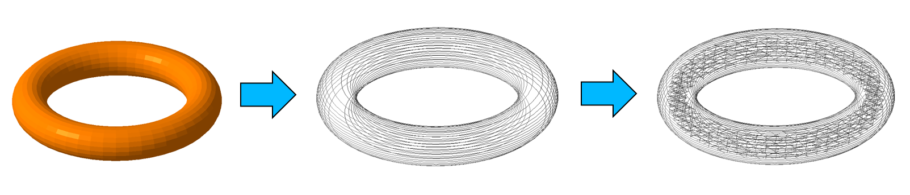
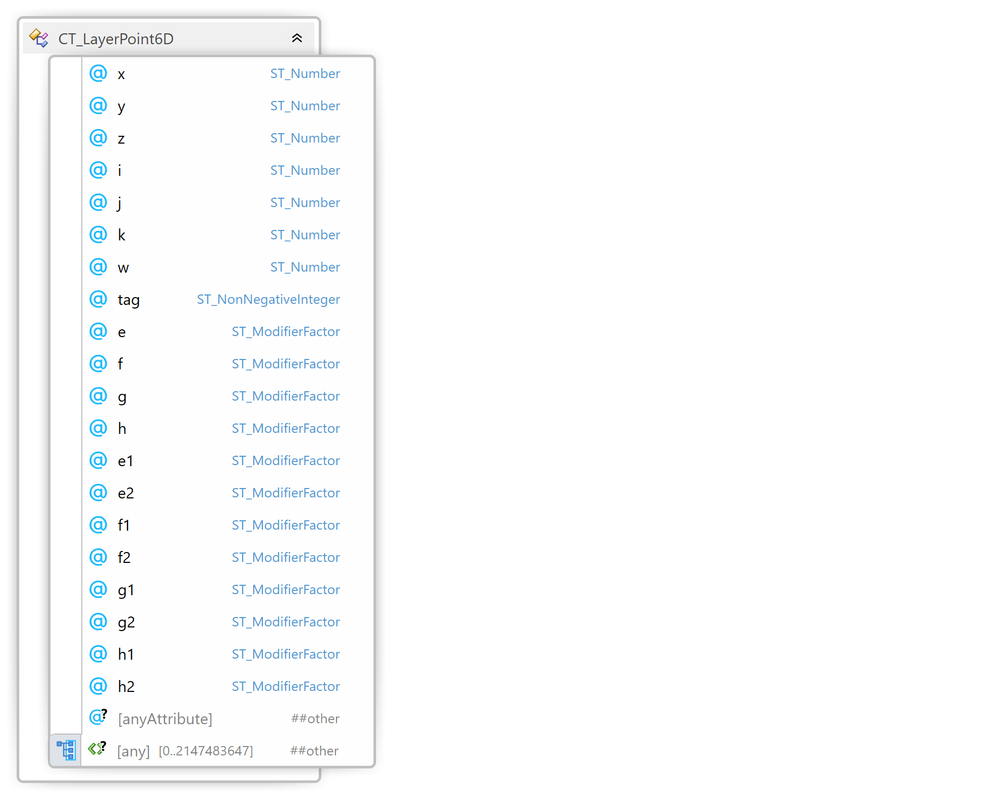

#
# 3MF Toolpath Extension

## Specification & Reference Guide


| **Version** | 0.8 |
| --- | --- |
| **Status** | Draft |

## Table of Contents

[Preface](#preface)

[About this Specification](#11-about-this-specification)

[Document Conventions](#12-document-conventions)

[Language Notes](#13-language-notes)

[Software Conformance](#14-software-conformance)

[Part I: 3MF Documents](#part-i-3mf-documents)

[Chapter 1. Overview of Additions](#chapter-1-overview-of-additions)

[Chapter 2. Object](#chapter-2-object)

[Chapter 3. Object](#chapter-3-toolpathlayer)

[Part II. Appendixes](#part-ii-appendixes)

[Appendix A. Glossary](#appendix-a-glossary)

[Appendix B. 3MF XSD Schema](#appendix-b-3mf-xsd-schema)

[Appendix C. Standard Namespace](#appendix-c-standard-namespace)

[Appendix D: Example file](#appendix-d-example-file)

[References](#references)


# Preface

## 1.1. About this Specification

This 3MF toolpath specification is an extension to the core 3MF specification. This document does not stand alone and only applies as an addendum to the core 3MF specification. Usage of this and any other 3MF extensions follow an a la carte model, defined in the core 3MF specification.

Part I, "3MF Documents," presents the details of the primarily XML-based 3MF Document format. This section describes the XML markup that defines the composition of 3D documents and the appearance of each model within the document.

Part II, "Appendixes," contains additional technical details and schemas too extensive to include in the main body of the text as well as convenient reference information.

The information contained in this specification is subject to change. Every effort has been made to ensure its accuracy at the time of publication.

This extension MUST be used only with Core specification 1.x. and Production extension specification 1.x.

## 1.2. Document Conventions

Except where otherwise noted, syntax descriptions are expressed in the ABNF format as defined in RFC 4234.

Glossary terms are formatted like _this_.

Syntax descriptions and code are formatted in `monospace` type.

Replaceable items, that is, an item intended to be replaced by a value, are formatted in _`monospace cursive`_ type.

Notes are formatted as follows:

>**Note:** This is a note.

## 1.3. Language Notes

In this specification, the words that are used to define the significance of each requirement are written in uppercase. These words are used in accordance with their definitions in RFC 2119, and their respective meanings are reproduced below:

- _MUST._ This word, or the adjective "REQUIRED" means that the item is an absolute requirement of the specification.
- _SHOULD._ This word, or the adjective "RECOMMENDED" means that there are valid reasons in particular circumstances to ignore this item, but the full implications should be understood and the case carefully weighed before choosing a different course.
- _MAY._ This word, or the adjective "OPTIONAL" means that this item is truly optional. For example, one implementation may choose to include the item because a particular marketplace or scenario requires it or because it enhances the product. Another implementation may omit the same item.

## 1.4. Software Conformance

Most requirements are expressed as format or package requirements rather than implementation requirements.

In order for consumers to be considered conformant, they must observe the following rules:

- They MUST NOT report errors when processing conforming instances of the document format except when forced to do so by resource exhaustion.
- They SHOULD report errors when processing non-conforming instances of the document format when doing so does not pose an undue processing or performance burden.

In order for producers to be considered conformant, they must observe the following rules:

- They MUST NOT generate any new, non-conforming instances of the document format.
- They MUST NOT introduce any non-conformance when modifying an instance of the document format.

Editing applications are subject to all of the above rules.


# Part I: 3MF Documents

# Chapter 1. Overview of Additions



This specification defines the Toolpath Extension for the 3MF file format. It introduces a standardized way to describe toolpath-based fabrication processes within 3MF documents, extending the existing slice-based representation to include precise motion and exposure instructions.

The Toolpath Extension enables detailed modeling of additive manufacturing processes across laser based technologies, with provisions for future use in deposition and hybrid systems. It supports 2.5-axis (planar), 3-axis, and 6-axis toolpaths, as well as multi-head synchronization and machine-specific parameters.

The extension is designed with flexibility and scalability in mind, allowing for:

- High-resolution geometric and exposure data per layer (e.g. laser power).

- Random layer access with minimal loading and memory overhead.

- Support for deterministic binary encoding.

- Extensibility through profiles, metadata, and proprietary namespaces

- Efficient compression and streaming of large datasets.

This specification MUST be supported by consumers that advertise support for the Toolpath Extension. While all toolpath elements are optional for producers, any producer using this extension MUST declare it as required in the 3MF package, as specified in the core 3MF standard. 

Consumers MAY choose to recalculate or reinterpret the toolpath data, but they MUST retain compatibility with the declared structure and semantics of the extension. Further customization is possible via private extensions or print ticket annotations.

The goal of this extension is to offer a structured, vendor-neutral, and scalable foundation for toolpath data that can bridge the gap between 3D geometry and machine execution, supporting the evolving ecosystem of industrial and open-source additive manufacturing systems.

The producer of a 3MF document with the toolpath extension MUST also include the production extension as required. A consumer of the toolpath extension MUST  also understand the production extension in the document. This ensures the availability of proper referenceable UUIDs throughout the document.


# Chapter 2. Planar toolpathes and 3-axis to 6 axis deposition toolpathes.

Additive manufacturing systems employ a wide range of motion and exposure technologies, from traditional planar layer-by-layer approaches to advanced multi-axis deposition strategies. The 3MF Toolpath Extension is designed to represent both categories in a unified and extensible framework.

## 2.1 Planar Toolpaths

Planar toolpaths describe geometry and process instructions that are confined to discrete, parallel layers along the Z-axis. This approach is commonly used in technologies such as:

- Stereolithography (SLA)

- Selective Laser Melting (SLM)

- Selective Laser Sintering (SLS)

- Fused Filament Fabrication (FFF)


Each layer consists of one or more 2D geometric primitives such as loops, polylines, hatches, arcs, and stripes. These are defined in the XY-plane and associated with a Z-height. This representation provides high resolution in XY and discrete control in Z, aligning closely with the native processing model of many industrial AM systems.

Planar toolpaths are especially well suited for:

- Layer-based exposure processes (e.g., galvanometer-driven laser systems)

- Parallelization of path execution (e.g., multi-laser platforms)

- Efficient compression and random access per layer

## 2.2 Multi Axis Deposition Toolpaths (3-6 axes)

Beyond planar systems, many additive processes now involve continuous motion in 3D space or require dynamic orientation of the tool or part. The Toolpath Extension supports:

- 3-axis toolpaths: Represented as spatial 3D curves or polylines. Used for freeform material deposition or point-wise energy delivery on non-planar surfaces.<!-- I'm confused...why nonplanar here. I understand that 2.5 can be nonplanar but only for FFF - not point-wise energy delivery -->

- 6-axis toolpaths: Represented as a 3 linear and 3 rotational values per point. This is required in robotic or multi-DOF systems where tool orientation is dynamically controlled (e.g., Directed Energy Deposition with a robot arm).

Each axis mode introduces increasing geometric and processing complexity but allows for:

- Non-planar slicing

- Conformal toolpaths

- Deposition on curved or dynamically repositioned surfaces

- Support for rotating or tilting buildplates, recoaters, or tool heads

3MF supports both representations under the same <toolpathlayers> construct, allowing for a consistent approach to synchronization, metadata assignment, and profile referencing.

## 2.3 Interoperability and Use

The structure allows producers to define hybrid toolpaths combining planar and spatial segments. Consumers are expected to interpret the dimensionality and semantics of each toolpath element from its type and associated metadata. Implementers should ensure deterministic parsing and robust support for layer-specific attributes and profile overrides.

## 2.4 Machine specific profile codecs

While the Toolpath Extension defines a set of standardized profile parameters suitable for general use, Additive Manufacturing machines often require specialized, hardware-dependent instructions to fully utilize their capabilities. To accommodate this, the extension supports machine-specific profile codecs through the use of custom XML namespaces and schema-defined profile structures.

#### Namespaced Custom Profiles

Producers MAY define additional profile attributes or structures using one or more unique XML namespaces. These extensions allow encoding of vendor-specific or machine-specific instructions, such as advanced scan strategies, dynamic focus control, synchronized motion patterns, or material-specific tuning.

Such machine-specific profiles:

- MUST be namespaced to avoid collisions with standard 3MF elements.

- MAY include mandatory parameters that are required by the target machine or control stack.

- MAY be accompanied by a schema definition external to the 3MF core, enabling validation by compatible tools.

#### Integration and Enforcement

A producer targeting a specific machine configuration:

- MUST declare the required namespace(s) in the profile section.

- SHOULD mark the associated extension as required within the 3MF package if it is essential for correct fabrication.

- MAY combine standardized and custom parameters within the same profile, as long as the semantics are unambiguous.

#### Consumer Behavior

Consumers that do not recognize a machine-specific namespace:

 - MUST ignore unrecognized parameters unless the extension is declared as required, in which case the consumer MUST reject the job.


- SHOULD provide a warning or fallback mechanism if partial interpretation is possible.

This mechanism ensures that 3MF remains extensible and practical for a wide range of hardware platforms while preserving compatibility and predictability across implementations.

# Chapter 3. OPC Packet Structure

The 3MF Toolpath Extension is structured using the Open Packaging Convention (OPC), allowing efficient organization, referencing, and streaming of toolpath data. The OPC architecture enables the separation of layer data, profiles, and binary geometry into modular, independently accessible parts.

## 3.1 Layer-Scoped XML Parts

Each individual build layer is represented by a dedicated XML part, which contains the geometric and metadata information required to fabricate that specific layer. These per-layer XML documents allow for:

- Random access to individual layers

- Scalable handling of large datasets

- Efficient parallelization and streaming

The layer files are typically named and located under a defined folder structure, e.g.:

    /Toolpath/Layers/layer00001.xml  
    /Toolpath/Layers/layer00002.xml  
    /Toolpath/Layers/layer00003.xml  
    ...

>**Note:**
Each layer file contains geometry segments (e.g., loops, polylines, hatches) as well as metadata, references to toolpath profiles and build items. See Chapter 5 for the exact definitions.


## 3.2 Relationships and Binding

Each layer XML is referenced via an explicit OPC relationship from the main toolpath resource part. These relationships define the role, content type, and URI of each layer file. The root model (3dmodel.model) declares a relationship to the Toolpath Resource part, which in turn declares relationships to each layer.

This structure ensures:
- Deterministic resolution of resource dependencies

- Clear scoping of each layer’s content

- Compatibility with standard OPC parsers and tooling

#### Example Relationship Flow

    [3dmodel.model]
       └── rels/toolpathresource.model (Toolpath Resource)
               └── rels/layer00001.xml (Layer 1)
               └── rels/layer00002.xml (Layer 2)

#### Best Practices

Producers SHOULD avoid embedding all layer data directly in the toolpath resource to maximize scalability and reusability.

Each layer part SHOULD use consistent naming and indexing.

Consumers MUST follow OPC relationship resolution rules to locate and load layer parts.

This design supports efficient inspection, editing, and partial build strategies, and it allows hardware vendors to implement layer-specific optimizations without requiring full-model parsing.


# Chapter 4. Toolpath Resource XML Structure

Element **\<tp:toolpathresource>**


| Name   | Type   | Use   | Default   | Annotation |
| --- | --- | --- | --- | --- |
| id | **ST\_ResourceID** | required |  | Must be a unique resource ID in the model document. |<!-- why both id and uuid -->
| uuid | **ST\_UUID** | required |  | Global unique identifier . |
| unitfactor | **ST\_Number** | required |  | Unit scaling factor to be applied to toolpath coordinates. In millimeters. |
| toolpathtype | **ST_ToolpathType** | optional | planar | Type of toolpath described. Possible values are planar, 3axis, 6axis. |

## 4.1 Toolpath profiles


Element **\<tp:toolpathprofiles>**

The \<toolpathprofiles\> element contains list of toolpath profiles that allow a machine process to convert the geometric toolpath definition into low level machine instructions.

Element **\<tp:toolpathprofile>**

| Name   | Type   | Use   | Technology class | Annotation |
| --- | --- | --- | --- | --- |
| uuid | **ST\_UUID** | required |   | Unique identifier for this profile |
| name   | **ST\_String** | required |   | Name for this profile. Must be unique in the toolpath. | <!-- why is name required. This seems restrictive. -->
| laserpower | **ST\_PositiveNumber** | optional | lpbf | Laser processes: specifies the power of the laser used, measured in W. |
| laserspeed   | **ST\_PositiveNumber** | optional   | lpbf  | Laser processes: speed at which the projected laser spot moves while marking, measured in mm/s |
| jumpspeed   | **ST\_PositiveNumber** | optional   | lpbf  | Laser processes: speed at which the projected laser spot moves while not marking, measured in mm/s |
| laserfocus   | **ST\_Number** | optional   | lpbf  | Laser processes: Offset for the focal plane of the laser in mm. Positive means above the powder bed. |
| laserindex | **ST\_Integer** | optional  |  lpbf | Laser processes: ID of the laser to be used. |
| depositionspeed   | **ST\_PositiveNumber** | optional   | deposition | Deposition processes: speed at which the deposition head while extruding, measured in mm/s |
| beadwidth   | **ST\_PositiveNumber** | optional   | deposition | Deposition processes: Width of the deposited material. (approximated cross section) |
| beadheight   | **ST\_PositiveNumber** | optional   | deposition | Deposition processes: Height of the deposited material. (approximated cross section) |

The \<toolpathprofile\>-elements are used to specify the properties of a laser melting or deposition process. This specification declares the above list of generic values to use. A producer MUST ensure that all necessary profile values are properly declared for a specific application, or as enforced by a profile codec.

In case of a custom profile value, the name MUST be namespaced with a properly defined XML namespace.


## 4.2 Toolpath profile modifiers


Element **\<tp\:modifier>**

 Modifiers enable granular control without duplicating full profiles.

The **\<tp\:modifier>** element refines a parent **\<tp\:toolpathprofile>** by defining how one numeric profile attribute MAY be overridden *per geometry element* (e.g., per hatch line) or as a (linear or non-linear gradient) on a geometry element. The override is specified by a normalized scalar factor on those elements:

* One scalar factor for a constant override on the element
* Two scalar factors for a linear override on the element. This specifies a linear gradient from the start point to the end point.
* Two scalar factors plus a list of increasing internal support points for a non-linear override on the element. This allows to give a piecewise linear curve on an element with normalized values between 0 and 1 that map to the pointwise override.


A **\<tp\:modifier>**:

* **MUST** be a direct child of **\<tp\:toolpathprofile>**.
* **MUST** reference an attribute that already exists on the parent **\<tp\:toolpathprofile>** (including namespaced attributes).
* **MUST** apply only to attributes with numeric value types (integer or floating-point).
* **MUST** define a closed range \[**minvalue**, **maxvalue**] in the same units as the target attribute.
* **MAY** be declared multiple times in a profile, but **at most one** modifier **MUST** target a given attribute within that profile.

### Attributes

| Name      | Type                 | Use      | Default | Annotation                                                                                                                                                              |
| --------- | -------------------- | -------- | ------- | ----------------------------------------------------------------------------------------------------------------------------------------------------------------------- |
| attribute | **ST\_String**       | required |         | Name of the parent profile attribute to override. MAY be namespaced (e.g., `skywriting:mode`). The named attribute **MUST** exist on the parent element and be numeric. |
| type      | **ST\_ModifierType** | required |         | Override rule. One of `constant`, `linear`, `nonlinear`.                                                |
| minvalue  | **ST\_Number**       | required |         | Lower bound of the allowed/targetable value range for the attribute. Units MUST match the attribute. MUST be smaller than maxvalue.  |
| maxvalue  | **ST\_Number**       | required |         | Upper bound of the allowed/targetable value range for the attribute. Units MUST match the attribute. MUST be larger than minvalue. |
| factor    | **ST\_ModifierFactor** | required |         | Factor identifier. Allowed values are `"e"`, `"f"`, `"g"` and `"h"`. These correspond to per-segment override factors defined later in the layer data. |


>**Note:** The 3MF Toolpath specification deliberately restricts the applicable amount of modifiers per profile to four with a prescribed naming scheme. This allows implementers to find efficient data representations without taking too many special cases into consideration.

>**Note:** Many consumer applications do not have the technical capability to support modifiers at all, only on certain profile attributes or only certain modification types like constant overrides. The structure as defined in the 3MF specification allows consumers to check before printing.

While loading a 3MF Toolpath file, any consumer MUST run a sanity check of all profile modifications in the document, and MUST reject any document that contains any modifier that is not supported by the consumer. 

A producer MUST obey the following rules:

- For all override types, a toolpath layer geometry element may contain attributes `"e"`,`"f"`, `"g"`, `and "h"` for the constant case.

- For linear and nonlinear override types, a toolpath layer geometry element may _instead_ contain attributes `"e1"`,`"e2"`, `"f1"`,`"f2"`, `"g1"`, `"g2"`, and `"h1"`, `"h2"` for the start respective end point of the element.

- For non-linear types, an element may _in addition_ contain **\<sub>** child elements to specify a 0-1 parametrized piecewise-linear curve on the element (see below).

- No element may contain an override factor data that is more granular than its specified modifier type.

### Nonlinear Override Support Points

For modifiers with `type="nonlinear"`, geometry elements (`<hatch>` or `<point>`) MAY contain one or more **\<sub>** child elements. Each **\<sub>** element defines a support point on a piecewise-linear interpolation curve along the geometry element.

**Element \<sub>**

The **\<sub>** element specifies modifier factor values at a specific parametric position along its parent geometry element. The parametric position is normalized to the range \[0,&nbsp;1\], where 0 corresponds to the start of the element and 1 corresponds to the end.

Together with the modifier factor values on the parent element (given as `e1`/`e2`, `f1`/`f2`, `g1`/`g2`, `h1`/`h2`), the **\<sub>** elements define a piecewise-linear curve. Interpolation between the start-point values, the support points, and the end-point values MUST be linear within each segment of the piecewise curve.

| Name | Type                 | Use      | Annotation                                                                                                                     |
| ---- | -------------------- | -------- | ------------------------------------------------------------------------------------------------------------------------------ |
| t    | **ST\_Number**       | required | Parametric position along the parent element. MUST be strictly greater than 0 and strictly less than 1.                        |
| e    | **ST\_ModifierScale** | optional | Override factor value for the `e` modifier at parametric position `t`. MUST be between 0 and 1.                                |
| f    | **ST\_ModifierScale** | optional | Override factor value for the `f` modifier at parametric position `t`. MUST be between 0 and 1.                                |
| g    | **ST\_ModifierScale** | optional | Override factor value for the `g` modifier at parametric position `t`. MUST be between 0 and 1.                                |
| h    | **ST\_ModifierScale** | optional | Override factor value for the `h` modifier at parametric position `t`. MUST be between 0 and 1.                                |

**Producer rules:**

* Each **\<sub>** element MUST have a `t` attribute.
* At least one of `e`, `f`, `g`, `h` MUST be present on each **\<sub>** element.
* If multiple **\<sub>** elements are present, their `t` values MUST be strictly increasing in document order.
* **\<sub>** elements MUST only be present when the parent element also carries linear-style factor attributes (`e1`/`e2`, `f1`/`f2`, `g1`/`g2`, `h1`/`h2`).
* **\<sub>** elements MUST NOT appear on geometry elements whose associated profile modifier has `type` other than `nonlinear`.

**Consumer rules:**

* Consumers MUST interpolate linearly between consecutive support points (including the start and end values from the parent element).
* If a **\<sub>** element is missing a factor attribute that the parent element provides (e.g., the parent has `f1`/`f2` but the **\<sub>** omits `f`), the consumer MUST linearly interpolate that factor as if the **\<sub>** were not present for that factor.

**Interpolation model:**

Given a parent element with start value `f1`, end value `f2`, and _n_ **\<sub>** elements with positions t&#x2081;,&nbsp;t&#x2082;,&nbsp;&hellip;,&nbsp;t&#x2099; and values v&#x2081;,&nbsp;v&#x2082;,&nbsp;&hellip;,&nbsp;v&#x2099;, the effective value at parametric position _p_ (0&nbsp;&le;&nbsp;p&nbsp;&le;&nbsp;1) is obtained by piecewise-linear interpolation over the sequence of control points:

(0,&nbsp;f1),&ensp;(t&#x2081;,&nbsp;v&#x2081;),&ensp;(t&#x2082;,&nbsp;v&#x2082;),&ensp;&hellip;,&ensp;(t&#x2099;,&nbsp;v&#x2099;),&ensp;(1,&nbsp;f2)

#### Example (informative)

A hatch with a nonlinear `f` modifier that ramps up to full power in the first 20%, holds steady, then ramps down in the last 20%:

```xml
<hatch x1="0" y1="0" x2="10000" y2="0" f1="0.0" f2="0.0">
  <sub t="0.2" f="1.0"/>
  <sub t="0.8" f="1.0"/>
</hatch>
```

This produces: linear ramp 0.0&nbsp;&rarr;&nbsp;1.0 over \[0,&nbsp;0.2\], constant 1.0 over \[0.2,&nbsp;0.8\], linear ramp 1.0&nbsp;&rarr;&nbsp;0.0 over \[0.8,&nbsp;1\].

## 4.3 Toolpath layers


Element **\<tp:toolpathlayers>**

The \<toolpathlayers\> element contains a list of references to OPC packages that contain the specific layers.

| Name   | Type   | Use   | Default   | Annotation |
| --- | --- | --- | --- | --- |
| zbottom | **ST\_NonNegativeInteger** | required, if toolpathtype is "planar" |  0 | Bottom Z Value of the first layer. Not applicable for non-planar toolpaths. |


Element **\<tp:toolpathlayer>**

| Name   | Type   | Use   | Default   | Annotation |
| --- | --- | --- | --- | --- |
| ztop | **ST\_PositiveInteger** | **required, if toolpathtype is "planar" |   | Not applicable for non-planar toolpaths. MUST be larger than zbottom, as well as the ztop of the previous layer. |


## 4.4 Custom Toolpath Metadata

Element **\<tp\:toolpathdata>**

The **\<tp\:toolpathdata>** container provides a safe, vendor-neutral place to embed *producer-generated metadata* about a toolpath. It is intended for provenance, slicer settings snapshots, QA annotations, simulation results, or workflow tags that do **not** alter the normative execution semantics of the toolpath unless the extension is marked as required.

Child elements MUST be qualified with a namespace that is **not** any official 3MF Extension namespace (like core or production) . Producers MUST declare such namespaces at the **\<model>** element.

Within **\<tp\:toolpathdata>**, each vendor (or workflow) **MAY** define an arbitrary, well-formed XML subtree (elements, attributes, text). Sibling subtrees from different namespaces may coexist.

> **Note:** This specification deliberately treats the content model as open to maximize interoperability. The toolpathdata subtree is metadata only; its interpretation is outside the scope of this extension unless separately standardized by another extension and marked as required.

#### Security and parsing requirements

To keep 3MF packages self-contained and deterministic, consumers and producers MUST observe the following for all content under **\<tp\:toolpathdata>**:

* **No externalization.** Content MUST NOT cause dereferencing of external resources. This includes DTDs, external entities, XInclude, external schemas fetched at parse time, processing instructions with retrieval semantics, or URI/IRI attributes intended to be fetched at load time.
* **No CDATA.** Producers MUST NOT use `<![CDATA[ ... ]]>` sections; plain character data MUST be used instead.
* **No binary payloads.** Large binary data (e.g., images, logs) MUST NOT be embedded. If binary data is essential, it MAY be stored as a separate OPC part with an explicit relationship from **\<tp\:toolpathresource>** (outside of **\<tp\:toolpathdata>**) per OPC rules.
* **Well-formedness only.** Content MUST be well-formed XML. Validation of vendor schemas is optional; consumers MAY process child content with lax validation.
* **Determinism.** Child content MUST NOT instruct the consumer to execute scripts or transform/modify the package at load time.

#### Producer requirements

* Producers MAY add any number of namespaced child elements under **\<tp\:toolpathdata>**.
* If metadata is _essential_ to fabrication correctness, producers MUST expose it through a standardized extension or profile codec and MUST mark that extension as *required* at the **\<model>** level. If a metadata namespace is not required, the associated custom metadata alone MUST NOT be relied upon to change execution.
* Producers SHOULD keep metadata concise and human-auditable (e.g., key–value elements or small trees), and SHOULD document their namespaces in a proper maintained specification document..

#### Consumer requirements

* Consumers that do not recognize a child namespace MUST ignore it without error and MUST preserve it on read/modify/write round-trips.
* Consumers MUST enforce the prohibitions listed above. If violated, the document MUST be rejected.
* Consumers MAY surface the metadata to users (e.g., as read-only key–value views) and MAY implement vendor-specific enrichments where available.


#### Example (informative)

```xml
<tp:toolpathresource id="1" uuid="92f90fa0-e2cc-4cb0-a56b-aa4fd2f51868" unitfactor="0.001">
  <tp:toolpathdata>
    <mycompany:testmetadata>
      <mycompany:toolpathinfo used_compensation_mode="simple" machine_model="MySLM7000"/>
    </mycompany:testmetadata>
  </tp:toolpathdata>
  <!-- ... profiles and layers ... -->
</tp:toolpathresource>
```

> **Note:** The example shows a single vendor block. Multiple independent blocks (e.g., `<qa:report>…</qa:report>`, `<sim:results>…</sim:results>`) may be included side-by-side under **\<tp\:toolpathdata>**.


# Part II. Layer Data

This Part defines the representation of a toolpath layer and the rules for interpreting it. Unless noted otherwise, all coordinates are **integer device units** that MUST be converted to millimeters by multiplying with the parent **\<tp\:toolpathresource>**’s `unitfactor` (see Part I). Element and attribute names are case-sensitive.

Execution order of geometry MUST be the document order. Consumers MUST NOT reorder segments, 

# Chapter 1 - Layer ASCII XML Structure

Element **\<layer>**


* **Namespace (default):** `http://schemas.microsoft.com/3dmanufacturing/toolpath/2019/05`
* **Other namespaces:** Producers MAY declare additional namespaces for vendor metadata (e.g., `mycompany:`) or process attributes (e.g., `skywriting:`). A separate `bin:` namespace is reserved for a Binary Encoding extension.

Consumers MUST ignore unrecognized elements and attributes in namespaces other than the above default, except where this Part explicitly requires rejection.

## 1.1. References to Parts and Profiles

### 1.1.1 Parts


**Element \<parts>**

Provides local identifiers for build items referenced by geometry.

**Child element \<part>**

| Name | Type                    | Use      | Annotation                                                                     |
| ---- | ----------------------- | -------- | ------------------------------------------------------------------------------ |
| id   | **ST\_PositiveInteger** | required | Identifier unique **within the layer**.                                        |
| uuid | **ST\_UUID**            | required | UUID of the referenced build item present in the package. |

Segments MUST reference a part via an integer `partid`. If any segment does refer to a `partid` not specified the same layer, the consumer **MUST** reject the layer.

> **Note:** The `partid` is purposeful not guaranteed to be globally unique to easy implementation.

### 1.1.2 Profiles


**Element \<profiles>**

Maps local identifiers to Toolpath Profiles defined in the parent **\<tp\:toolpathresource>**.

**Child element \<profile>**

| Name | Type                    | Use      | Annotation                                                                                             |
| ---- | ----------------------- | -------- | ------------------------------------------------------------------------------------------------------ |
| id   | **ST\_PositiveInteger** | required | Identifier unique **within the layer**.                                                                |
| uuid | **ST\_UUID**            | required | UUID of a **\<tp\:toolpathprofile>** declared under the parent resource’s **\<tp\:toolpathprofiles>**. |

Each segment MUST specify `profileid`. If any segment does refer to a `profileid` not specified the same layer, the consumer **MUST** reject the layer.

---

## 1.2. Segment Data


**Element \<segments>**

Contains one or more **\<segment>** elements. Segments build a common wrapper class for types of toolpath geometry, and derive into specialist XML nodes, which then give proper information about.

All segments are supposed to be executed sequentially in the order within the **\<segments>** element. For parallel processing, see the chapter below.


**Element \<segment>**


| Name      | Type                       | Use      | Default | Annotation                                                            |
| --------- | -------------------------- | -------- | ------- | --------------------------------------------------------------------- |
| type      | **ST\_String**             | required |         | One of `loop`, `polyline`, `hatch`.                                   |
| profileid | **ST\_PositiveInteger**    | required |         | Resolves via **\<profiles>** (§2.2).                                  |
| partid    | **ST\_PositiveInteger**    | optional |         | Resolves via **\<parts>** (§2.1).                                     |
| laserindex | **ST\_Integer**           | optional |         | Laser processes: overrides the `laserindex` of the referenced profile for this segment. If present, a consumer MUST use this value instead of the profile's `laserindex` to select the laser unit. If absent, the profile's `laserindex` applies. |
| timeprediction | **ST\_NonNegativeInteger** | optional |     | Producer-estimated execution time of this segment, in microseconds. This is the time the machine is expected to spend marking (exposing) the geometry contained in this segment. Consumers MAY use this value for progress estimation, scheduling, or validation, but MUST NOT rely on it for safety-critical timing. |
| jumpprediction | **ST\_NonNegativeInteger** | optional |     | Producer-estimated jump time to reach the start of this segment from the end of the preceding segment (or the machine origin for the first segment in a layer), in microseconds. This accounts for non-marking repositioning. Consumers MAY use this value for progress estimation, scheduling, or validation, but MUST NOT rely on it for safety-critical timing. |
| tag       | **ST\_NonNegativeInteger** | optional |         | Producer-defined grouping or ordering hint. Consumers **MAY** ignore. |

A segment node MAY include arbitrary attributes, if they are properly namespaced. A consumer MUST understand all used namespaces of a layer XML, or reject the layer.

## 1.3. Planar Segment Data


Planar segments describe marking geometry in the XY plane of the layer. In this case Z is implied by the associated **\<tp\:toolpathlayer>** in the parent resource.

Planar segment elements MUST NOT be used, if the **\<tp\:toolpathresource>**'s `toolpathtype` is not equal to `planar`.

### 1.3.1 Children of Segment

The _type_ attribute of a segment determines its acceptable XML child nodes. 

**Child \<point> (planar)**


For type `loop` and `polyline`, the segment MUST contain a non-empty list planar points.

| Name      | Type            | Use      | Annotation                                                                                 |
| --------- | --------------- | -------- | ------------------------------------------------------------------------------------------ |
| x         | **ST\_Integer** | required | X coordinate (device units).                                                               |
| y         | **ST\_Integer** | required | Y coordinate (device units).                                                               |
| tag       | **ST\_NonNegativeInteger** | optional | Producer-defined marker for the line that the point closes. Tags have no direct meaning, but MAY be referenced from Metadata. |
| e         | **ST\_ModifierScale** | optional | Scale factor for a constant `e` modifier for the line that the point closes. MUST be a number value between 0 and 1. MUST NOT be given, if `e1` or `e2` are present. |
| f         | **ST\_ModifierScale** | optional | Scale factor for a constant `f` modifier for the line that the point closes. MUST be a number value between 0 and 1. MUST NOT be given, if `f1` or `f2` are present. |
| g         | **ST\_ModifierScale** | optional | Scale factor for a constant `g` modifier for the line that the point closes. MUST be a number value between 0 and 1. MUST NOT be given, if `g1` or `g2` are present. |
| h         | **ST\_ModifierScale** | optional | Scale factor for a constant `h` modifier for the line that the point closes. MUST be a number value between 0 and 1. MUST NOT be given, if `h1` or `h2` are present. |
| e1, e2         | **ST\_ModifierScale** | optional | First and second scale factors for a linear `e` modifier for the line that the point closes. MUST be a number value between 0 and 1.  MUST NOT be given, if `e` is present. If `e1` is given, ´e2´ MUST be present, and vice versa. |
| f1, f2         | **ST\_ModifierScale** | optional | First and second scale factors for a linear `f` modifier for the line that the point closes. MUST be a number value between 0 and 1.  MUST NOT be given, if `f` is present. If `f1` is given, ´f2´ MUST be present, and vice versa. |
| g1, g2         | **ST\_ModifierScale** | optional | First and second scale factors for a linear `g` modifier for the line that the point closes. MUST be a number value between 0 and 1.  MUST NOT be given, if `g` is present. If `g1` is given, ´g2´ MUST be present, and vice versa. |
| h1, h2         | **ST\_ModifierScale** | optional | First and second scale factors for a linear `h` modifier for the line that the point closes. MUST be a number value between 0 and 1.  MUST NOT be given, if `g` is present. If `g1` is given, ´g2´ MUST be present, and vice versa. |


**Child \<hatch> (planar)**


For type `hatch`, the segment MUST contain a non-empty list planar hatches.

| Name      | Type            | Use      | Annotation                                                                                 |
| --------- | --------------- | -------- | ------------------------------------------------------------------------------------------ |
| x1         | **ST\_Integer** | required | X coordinate of the first hatch point (device units).                                                               |
| y1         | **ST\_Integer** | required | Y coordinate of the first hatch point (device units).                                                               |
| x2         | **ST\_Integer** | required | X coordinate of the second hatch point (device units).                                                               |
| y2         | **ST\_Integer** | required | Y coordinate of the second hatch point (device units).                                                               |
| tag       | **ST\_NonNegativeInteger** | optional | Producer-defined marker for the hatch line. Tags have no direct meaning, but MAY be referenced from Metadata. |
| e         | **ST\_ModifierScale** | optional | Scale factor for a constant `e` modifier for the hatch line that the point closes. MUST be a number value between 0 and 1. MUST NOT be given, if `e1` or `e2` are present. |
| f         | **ST\_ModifierScale** | optional | Scale factor for a constant `f` modifier for the line that the point closes. MUST be a number value between 0 and 1. MUST NOT be given, if `f1` or `f2` are present. |
| g         | **ST\_ModifierScale** | optional | Scale factor for a constant `g` modifier for the line that the point closes. MUST be a number value between 0 and 1. MUST NOT be given, if `g1` or `g2` are present. |
| h         | **ST\_ModifierScale** | optional | Scale factor for a constant `h` modifier for the line that the point closes. MUST be a number value between 0 and 1. MUST NOT be given, if `h1` or `h2` are present. |
| e1, e2         | **ST\_ModifierScale** | optional | First and second scale factors for a linear `e` modifier for the line that the point closes. MUST be a number value between 0 and 1.  MUST NOT be given, if `e` is present. If `e1` is given, ´e2´ MUST be present, and vice versa. |
| f1, f2         | **ST\_ModifierScale** | optional | First and second scale factors for a linear `f` modifier for the line that the point closes. MUST be a number value between 0 and 1.  MUST NOT be given, if `f` is present. If `f1` is given, ´f2´ MUST be present, and vice versa. |
| g1, g2         | **ST\_ModifierScale** | optional | First and second scale factors for a linear `g` modifier for the line that the point closes. MUST be a number value between 0 and 1.  MUST NOT be given, if `g` is present. If `g1` is given, ´g2´ MUST be present, and vice versa. |
| h1, h2         | **ST\_ModifierScale** | optional | First and second scale factors for a linear `h` modifier for the line that the point closes. MUST be a number value between 0 and 1.  MUST NOT be given, if `g` is present. If `g1` is given, ´g2´ MUST be present, and vice versa. |


**Child \<point3d> (3axis)**


For type `polyline3d`, the segment MUST contain a non-empty list 3axis points.

| Name      | Type            | Use      | Annotation                                                                                 |
| --------- | --------------- | -------- | ------------------------------------------------------------------------------------------ |
| x         | **ST\_Integer** | required | X coordinate (device units).                                                               |
| y         | **ST\_Integer** | required | Y coordinate (device units).                                                               |
| z         | **ST\_Integer** | required | Z coordinate (device units).                                                               |
| tag       | **ST\_NonNegativeInteger** | optional | Producer-defined marker for the line that the point closes. Tags have no direct meaning, but MAY be referenced from Metadata. |
| e         | **ST\_ModifierScale** | optional | Scale factor for a constant `e` modifier for the line that the point closes. MUST be a number value between 0 and 1. MUST NOT be given, if `e1` or `e2` are present. |
| f         | **ST\_ModifierScale** | optional | Scale factor for a constant `f` modifier for the line that the point closes. MUST be a number value between 0 and 1. MUST NOT be given, if `f1` or `f2` are present. |
| g         | **ST\_ModifierScale** | optional | Scale factor for a constant `g` modifier for the line that the point closes. MUST be a number value between 0 and 1. MUST NOT be given, if `g1` or `g2` are present. |
| h         | **ST\_ModifierScale** | optional | Scale factor for a constant `h` modifier for the line that the point closes. MUST be a number value between 0 and 1. MUST NOT be given, if `h1` or `h2` are present. |
| e1, e2         | **ST\_ModifierScale** | optional | First and second scale factors for a linear `e` modifier for the line that the point closes. MUST be a number value between 0 and 1.  MUST NOT be given, if `e` is present. If `e1` is given, ´e2´ MUST be present, and vice versa. |
| f1, f2         | **ST\_ModifierScale** | optional | First and second scale factors for a linear `f` modifier for the line that the point closes. MUST be a number value between 0 and 1.  MUST NOT be given, if `f` is present. If `f1` is given, ´f2´ MUST be present, and vice versa. |
| g1, g2         | **ST\_ModifierScale** | optional | First and second scale factors for a linear `g` modifier for the line that the point closes. MUST be a number value between 0 and 1.  MUST NOT be given, if `g` is present. If `g1` is given, ´g2´ MUST be present, and vice versa. |
| h1, h2         | **ST\_ModifierScale** | optional | First and second scale factors for a linear `h` modifier for the line that the point closes. MUST be a number value between 0 and 1.  MUST NOT be given, if `g` is present. If `g1` is given, ´g2´ MUST be present, and vice versa. |


**Child \<point6d> (6axis)**



For type `polyline3d`, the segment MUST contain a non-empty list 3axis points.

| Name      | Type            | Use      | Annotation                                                                                 |
| --------- | --------------- | -------- | ------------------------------------------------------------------------------------------ |
| x         | **ST\_Integer** | required | X coordinate (device units).                                                               |
| y         | **ST\_Integer** | required | Y coordinate (device units).                                                               |
| z         | **ST\_Integer** | required | Z coordinate (device units).                                                               |
| i         | **ST\_Number** | required | Quaternion `i` value of a reference frame at the point.                                                               |
| j         | **ST\_Number** | required | Quaternion `j` value of a reference frame at the point.                                                               |
| k         | **ST\_Number** | required | Quaternion `k` value of a reference frame at the point.                                                               |
| w         | **ST\_Number** | required | Quaternion `w` value of a reference frame at the point.                                                               |
| tag       | **ST\_NonNegativeInteger** | optional | Producer-defined marker for the line that the point closes. Tags have no direct meaning, but MAY be referenced from Metadata. |
| e         | **ST\_ModifierScale** | optional | Scale factor for a constant `e` modifier for the line that the point closes. MUST be a number value between 0 and 1. MUST NOT be given, if `e1` or `e2` are present. |
| f         | **ST\_ModifierScale** | optional | Scale factor for a constant `f` modifier for the line that the point closes. MUST be a number value between 0 and 1. MUST NOT be given, if `f1` or `f2` are present. |
| g         | **ST\_ModifierScale** | optional | Scale factor for a constant `g` modifier for the line that the point closes. MUST be a number value between 0 and 1. MUST NOT be given, if `g1` or `g2` are present. |
| h         | **ST\_ModifierScale** | optional | Scale factor for a constant `h` modifier for the line that the point closes. MUST be a number value between 0 and 1. MUST NOT be given, if `h1` or `h2` are present. |
| e1, e2         | **ST\_ModifierScale** | optional | First and second scale factors for a linear `e` modifier for the line that the point closes. MUST be a number value between 0 and 1.  MUST NOT be given, if `e` is present. If `e1` is given, ´e2´ MUST be present, and vice versa. |
| f1, f2         | **ST\_ModifierScale** | optional | First and second scale factors for a linear `f` modifier for the line that the point closes. MUST be a number value between 0 and 1.  MUST NOT be given, if `f` is present. If `f1` is given, ´f2´ MUST be present, and vice versa. |
| g1, g2         | **ST\_ModifierScale** | optional | First and second scale factors for a linear `g` modifier for the line that the point closes. MUST be a number value between 0 and 1.  MUST NOT be given, if `g` is present. If `g1` is given, ´g2´ MUST be present, and vice versa. |
| h1, h2         | **ST\_ModifierScale** | optional | First and second scale factors for a linear `h` modifier for the line that the point closes. MUST be a number value between 0 and 1.  MUST NOT be given, if `g` is present. If `g1` is given, ´g2´ MUST be present, and vice versa. |


### 1.3.2 Polyline Segment (planar)

Open polyline executed as a continuous mark. 

**Children**

* Two or more **\<point>** element (MUST be ≥ 2).


### 1.3.2 Loop Segment (planar)

Closed polygon executed as a continuous mark. If the last point in the list is not the equal the closing segment from the last point to the first is **implied**. 

**Children**

* Two or more **\<point>** element (MUST be ≥ 3).

**Child \<point> (planar)**

| Name      | Type            | Use      | Annotation                                                                                 |
| --------- | --------------- | -------- | ------------------------------------------------------------------------------------------ |
| x         | **ST\_Integer** | required | X coordinate (device units).                                                               |
| y         | **ST\_Integer** | required | Y coordinate (device units).                                                               |
| tag       | **ST\_NonNegativeInteger** | optional | Producer-defined marker for the line that the point closes. The tag of the first point in the list will attach to the closure of the loop, should it be needed. Tags have no direct meaning, but can be referenced from Metadata. |
| f         | **ST\_ModifierScale** | optional | Scale factor for a constant `f` modifier for the line that the point closes. The tag of the first point in the list will attach to the closure of the loop, should it be needed. MUST be a number value between 0 and 1. |
| g         | **ST\_ModifierScale** | optional | Scale factor for a constant `g` modifier for the line that the point closes. The tag of the first point in the list will attach to the closure of the loop, should it be needed. MUST be a number value between 0 and 1. |
| h         | **ST\_ModifierScale** | optional | Scale factor for a constant `h` modifier for the line that the point closes. The tag of the first point in the list will attach to the closure of the loop, should it be needed. MUST be a number value between 0 and 1. |
| k         | **ST\_ModifierScale** | optional | Scale factor for a constant `k` modifier for the line that the point closes. The tag of the first point in the list will attach to the closure of the loop, should it be needed. MUST be a number value between 0 and 1. |


### 1.3.3 Hatch Segment (planar)

Set of independent straight lines. Each line is executed separately; travel between lines is a **jump**.

**Children**

* One or more **\<hatch>**.

**Child \<hatch>**

| Name      | Type                       | Use      | Annotation                                                   |
| --------- | -------------------------- | -------- | ------------------------------------------------------------ |
| x1    | **ST\_Integer**            | required | x coordinate of the start point of the hatch (in device units).                                  |
| y1    | **ST\_Integer**            | required | y coordinate of the start point of the hatch (in device units).                                  |
| x2    | **ST\_Integer**            | required | x coordinate of the start point of the hatch (in device units).                                  |
| y2    | **ST\_Integer**            | required | y coordinate of the start point of the hatch (in device units).                                  |
| tag       | **ST\_NonNegativeInteger** | optional | Producer-defined marker for this line.                       |
| f         | **ST\_ModifierScale** | optional | Scale factor for a constant `f` modifier for the full hatch. MUST be a number value between 0 and 1. |
| g         | **ST\_ModifierScale** | optional | Scale factor for a potential `g` modifier at this point. MUST be a number value between 0 and 1. |
| h         | **ST\_ModifierScale** | optional | Scale factor for a potential `h` modifier at this point. MUST be a number value between 0 and 1. |
| k         | **ST\_ModifierScale** | optional | Scale factor for a potential `k` modifier at this point. MUST be a number value between 0 and 1. |

---


# Part III. Appendixes

## Appendix A. Glossary

**3D model.** The markup that defines a model for output.

**3D Model part.** The OPC part that contains a 3D model.

**3D Texture part.** A file used to apply complex information to a 3D object in the 3D Model part. In this extension spec, it is specifically a TBMP file.

**3MF.** The 3D Manufacturing Format described by this specification, defining one or more 3D objects intended for output to a physical form.

**3MF Document.** The digital manifestation of an OPC package that contains a 3D payload that conforms with the 3MF specification.

**Composite material.** A material that is comprised of a ratio of other materials.

**Consumer.** A software, service, or device that reads in a 3MF Document.

**Editor.** A software, service, or device that both reads in and writes out 3MF Documents, possibly changing the content in between.

**Material.** The description of a physical substance that can be used to output an object.

**Material resource.** A potential resource that might be referenced by an object to describe what the object will be made of.

**Producer.** A software, service, or device that writes out a 3MF Document.

**Resource.** A texture, color, material, action, or object that could be used by another resource or might be necessary to build a physical 3D object according to build instructions.

**Texture resource.** A resource that describes a subset of the 3D data to be used and how it is to be tiled.

**XML namespace.** A namespace declared on the \<model> element, in accordance with the XML Namespaces specification.

## Appendix B. 3MF XSD Schema

```xml
<?xml version="1.0" encoding="UTF-8"?> 
<xs:schema xmlns="http://schemas.microsoft.com/3dmanufacturing/lasertoolpath/2018/05" xmlns:xs="http://www.w3.org/2001/XMLSchema" xmlns:xml="http://www.w3.org/XML/1998/namespace" 
targetNamespace="http://schemas.microsoft.com/3dmanufacturing/lasertoolpath/2018/05" elementFormDefault="unqualified" attributeFormDefault="unqualified" blockDefault="#all"> 
	<xs:import namespace="http://www.w3.org/XML/1998/namespace" schemaLocation="http://www.w3.org/2001/xml.xsd"/>
  <xs:annotation> 
		<xs:documentation><![CDATA[   Schema notes: 
 
  Items within this schema follow a simple naming convention of appending a prefix indicating the type of element for references: 
 
  Unprefixed: Element names 
  CT_: Complex types 
  ST_: Simple types 
   
  ]]></xs:documentation> 
	</xs:annotation> 
	<!-- Complex Types --> 
	<xs:complexType name="CT_Slice"> 
		<xs:attribute name="toolpath" type="ST_UriReference" use="optional"/>
		<xs:anyAttribute namespace="##other" processContents="lax"/>
	</xs:complexType>
	<!-- Simple Types -->
	<xs:simpleType name="ST_UriReference"> 
		<xs:restriction base="xs:anyURI"> 
			<xs:pattern value="/.*"/> 
		</xs:restriction> 
	</xs:simpleType>
	<!-- Elements --> 
</xs:schema>
```


# Appendix C. Standard Namespace

| | |
| --- | --- |
|LaserToolpath    |  [http://schemas.microsoft.com/3dmanufacturing/lasertoolpath/2018/05](http://schemas.microsoft.com/3dmanufacturing/lasertoolpath/2018/05 ) |
|LaserToolpathLayer | [http://schemas.microsoft.com/3dmanufacturing/lasertoolpathlayer/2018/05](http://schemas.microsoft.com/3dmanufacturing/lasertoolpathlayer/2018/05 ) |


# Appendix D: Example file

```

## Toolpathlayer
```xml
<?xml version="1.0" encoding="utf-8"?> ...
```

# References

**BNF of Generic URI Syntax**

"BNF of Generic URI Syntax." World Wide Web Consortium. http://www.w3.org/Addressing/URL/5\_URI\_BNF.html

**Open Packaging Conventions**

Ecma International. "Office Open XML Part 2: Open Packaging Conventions." 2006. http://www.ecma-international.org

**sRGB**

Anderson, Matthew, Srinivasan Chandrasekar, Ricardo Motta, and Michael Stokes. "A Standard Default Color Space for the Internet-sRGB, Version 1.10." World Wide Web Consortium. 1996. http://www.w3.org/Graphics/Color/sRGB

**Unicode**

The Unicode Consortium. The Unicode Standard, Version 4.0.0, defined by: _The Unicode Standard, Version 4.0_. Boston, MA: Addison-Wesley, 2003.

**XML**

Bray, Tim, Eve Maler, Jean Paoli, C. M. Sperlberg-McQueen, and François Yergeau (editors). "Extensible Markup Language (XML) 1.0 (Fourth Edition)." World Wide Web Consortium. 2006. http://www.w3.org/TR/2006/REC-xml-20060816/

XML C14N

Boyer, John. "Canonical XML Version 1.0." World Wide Web Consortium. 2001. http://www.w3.org/TR/xml-c14n.

XML Namespaces

Bray, Tim, Dave Hollander, Andrew Layman, and Richard Tobin (editors). "Namespaces in XML 1.0 (Second Edition)." World Wide Web Consortium. 2006. http://www.w3.org/TR/2006/REC-xml-names-20060816/

XML Schema

Beech, David, Murray Maloney, Noah Mendelsohn, and Henry S. Thompson (editors). "XML Schema Part 1: Structures," Second Edition. World Wide Web Consortium. 2004. http://www.w3.org/TR/2004/REC-xmlschema-1-20041028/

Biron, Paul V. and Ashok Malhotra (editors). "XML Schema Part 2: Datatypes," Second Edition. World Wide Web Consortium. 2004. http://www.w3.org/TR/2004/REC-xmlschema-2-20041028/
