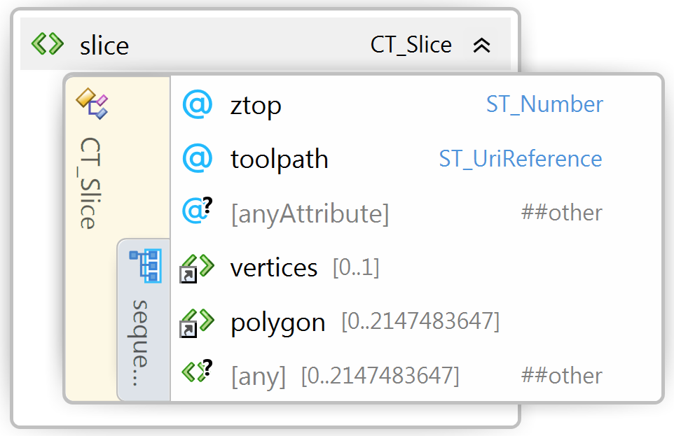
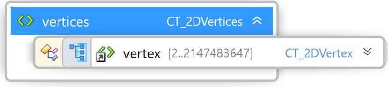
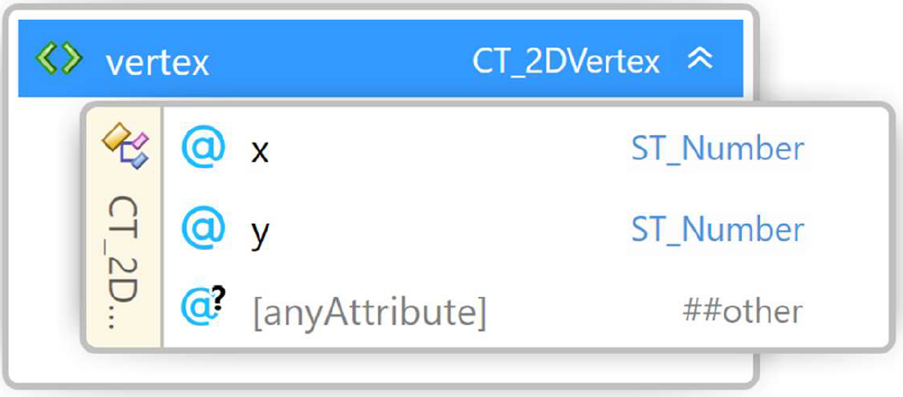

#
# 3MF Laser Toolpath Extension

## Specification & Reference Guide


| **Version** | 0.1 |
| --- | --- |
| **Status** | Draft |

## Table of Contents

[Preface](#preface)

[About this Specification](#11-about-this-specification)

[Document Conventions](#12-document-conventions)

[Language Notes](#13-language-notes)

[Software Conformance](#14-software-conformance)

[Part I: 3MF Documents](#part-i-3mf-documents)

[Chapter 1. Overview of Additions](#chapter-1-overview-of-additions)

[Chapter 2. Object](#chapter-2-object)

[Chapter 3. Object](#chapter-3-toolpathlayer)

[Part II. Appendixes](#part-ii-appendixes)

[Appendix A. Glossary](#appendix-a-glossary)

[Appendix B. 3MF XSD Schema](#appendix-b-3mf-xsd-schema)

[Appendix C. Standard Namespace](#appendix-c-standard-namespace)

[Appendix D: Example file](#appendix-d-example-file)

[References](#references)


# Preface

## 1.1. About this Specification

This 3MF laser toolpath specification is an extension to the core 3MF specification. This document cannot stand alone and only applies as an addendum to the core 3MF specification. Usage of this and any other 3MF extensions follow an a la carte model, defined in the core 3MF specification.

Part I, "3MF Documents," presents the details of the primarily XML-based 3MF Document format. This section describes the XML markup that defines the composition of 3D documents and the appearance of each model within the document.

Part II, "Appendixes," contains additional technical details and schemas too extensive to include in the main body of the text as well as convenient reference information.

The information contained in this specification is subject to change. Every effort has been made to ensure its accuracy at the time of publication.

This extension MUST be used only with Core specification 1.x. and Slice extension specification 1.x.

## 1.2. Document Conventions

Except where otherwise noted, syntax descriptions are expressed in the ABNF format as defined in RFC 4234.

Glossary terms are formatted like _this_.

Syntax descriptions and code are formatted in `monospace` type.

Replaceable items, that is, an item intended to be replaced by a value, are formatted in _`monospace cursive`_ type.

Notes are formatted as follows:

>**Note:** This is a note.

## 1.3. Language Notes

In this specification, the words that are used to define the significance of each requirement are written in uppercase. These words are used in accordance with their definitions in RFC 2119, and their respective meanings are reproduced below:

- _MUST._ This word, or the adjective "REQUIRED" means that the item is an absolute requirement of the specification.
- _SHOULD._ This word, or the adjective "RECOMMENDED" means that there may exist valid reasons in particular circumstances to ignore this item, but the full implications should be understood and the case carefully weighed before choosing a different course.
- _MAY._ This word, or the adjective "OPTIONAL" means that this item is truly optional. For example, one implementation may choose to include the item because a particular marketplace or scenario requires it or because it enhances the product. Another implementation may omit the same item.

## 1.4. Software Conformance

Most requirements are expressed as format or package requirements rather than implementation requirements.

In order for consumers to be considered conformant, they must observe the following rules:

- They MUST NOT report errors when processing conforming instances of the document format except when forced to do so by resource exhaustion.
- They SHOULD report errors when processing non-conforming instances of the document format when doing so does not pose an undue processing or performance burden.

In order for producers to be considered conformant, they must observe the following rules:

- They MUST NOT generate any new, non-conforming instances of the document format.
- They MUST NOT introduce any non-conformance when modifying an instance of the document format.

Editing applications are subject to all of the above rules.


# Part I: 3MF Documents

# Chapter 1. Overview of Additions


This document describes new elements, each of which is OPTIONAL for producers, but MUST be supported by consumers that specify support for this laser toolpath extension of 3MF.

The slice specification has introduced a layer-based representation of the build data inside a 3MF document in order to provide a more process dependent representation of the content. This allows for a more detailed modelling of geometrical details (high-resolution in XY, discrete in Z) in a way 
that is better suited for the 3D printing process.

The laser toolpath specification extends this layer-based representation by accounting for layer-based point-exposure technologies. It allows the accurate specification of the laser path in great detail.
This covers the 3 major branches of industrial 3D Printing, namely SLA, SLM and SLS.

A consumer MAY calculate a different toolpath than the one specified by this extension. In addition, private extensions, information in the printticket can be used to specify machine specific parameters.

I don't think so: A producer using the laser toolpath specification MUST mark the extension as required, as described in the core specification.

##### Figure 2-1: Overview of model XML structure of 3MF with laser toolpath additions.

#####


##### Figure 2-2: Overview of model XML structure of the lasertoolpathlayer document.

#####


# Chapter 2. Slice

Element **\<slice>**



| Name   | Type   | Use   | Default   | Annotation |
| --- | --- | --- | --- | --- |
| toolpath | **ST\_UriReference** | optional |   | toolpath an absolute path to a toolpathlayer file within the 3MF package that contains toolpathlayer content. TODO: call it toolpathpath? |

This 3MF laser toolpath extension specification defines a new \<toolpath\>-attribute that lives inside a \<slice\> element from the Slices extension specification, as the toolpath structure is intended to be subject to the same coordinate system and to the same ztop-coordinate as the slice. This is the only entry point to the toolpath specification.
Each toolpath.xml describes what is in this slice. Since slices can be for \<object\> (i.e. as mesh- or a components-object, it represents the build instructions for this slice of this \<object\>).

TODO: Unification rules
- Unify with different ztop. Producers SHOULD use same z-top for all toolpathxml
- Unify from different objects

TODO: slice specification: case where slices are referenced from components, and a component-object of this components-object references slice-geometry again.


# Chapter 3. Toolpathlayer
Not a model file, subject to different schema xmlns=”http://schemas.microsoft.com/3dmanufacturing/laserpathlayer/2018/05” 
TODO: describe that this requires an OPC relation

## 3.1. Profiles

Element **\<profiles>**

## 3.1.1 Profile

Element **\<profile>**

| Name   | Type   | Use   | Default   | Annotation |
| --- | --- | --- | --- | --- |
| id | **ST\_PositiveNumber** | required |   | Unique identifier for this profile |
| name   | **ST\_String** | required |   | Name for this profile. Must not be unique. |
| laserpower | **ST\_PositiveNumber** | required | none | Specifies the power of the laser used, measured in W. TODO: correct physical quantity? Useful unit?|
| exposurespeed   | **ST\_PositiveNumber** | required   |   | speed at which the projected laser spot moves measured in mm/s TODO: units? |
| laserfocus   | **ST\_PositiveNumber** | required   |   | Units? TODO: spotsize? |
| laserindex | **ST\_PositiveNumber** | optional  |   | ID of the laser to be used. TODO: allow "any" OR make it optional. |

The \<profile\>-elements are used to specify the properties of a laser.


## 3.2. Vertices
Element **\<vertices>**



The vertices element contains all the \<vertex\> elements for this toolpathlayer.
The vertices represent the points that the toolpaths in this layer can traverse.
The order of these elements defines an implicit 0-based index that is referenced by other elements,
such as the \<element\>-element. The producer SHOULD NOT include duplicate vertices.
Furthermore, a producer SHOULD collapse vertices that are very closely proximal with a single vertex whenever appropriate.
In order to avoid integer overflows, a \<vertices\> element MUST contain less than 2^31 \<vertex\>-elements.

## 3.2.1 Vertex
Element **\<vertex>**



| Name   | Type   | Use   | Default   | Annotation |
| --- | --- | --- | --- | --- |
| x | **ST\_Number** | required |   | The position of the vertex along the X axis. |
| y | **ST\_Number** | required |   | The position of the vertex along the Y axis. |

A \<vertex\> element represents a point in 2-dimensional space that is referenced by a segment in the
toolpath. The decimal values representing the coordinates can be recorded to arbitrary precision. The
precision used should be no higher than that expected from the producer’s calculations.


## 3.3. Elements TODO: different name
Element **\<elements>**

TODO: different "types" of elements could be different XML-elements. Will make specification easier.

To describe continuously varying properties (e.g. speeds). Cut the polygon and use different profiles that discretise any non-constant properties.


# Part II. Appendixes

## Appendix A. Glossary

**3D model.** The markup that defines a model for output.

**3D Model part.** The OPC part that contains a 3D model.

**3D Texture part.** A file used to apply complex information to a 3D object in the 3D Model part. In this extension spec, it is specifically a TBMP file.

**3MF.** The 3D Manufacturing Format described by this specification, defining one or more 3D objects intended for output to a physical form.

**3MF Document.** The digital manifestation of an OPC package that contains a 3D payload that conforms with the 3MF specification.

**Composite material.** A material that is comprised of a ratio of other materials.

**Consumer.** A software, service, or device that reads in a 3MF Document.

**Editor.** A software, service, or device that both reads in and writes out 3MF Documents, possibly changing the content in between.

**Material.** The description of a physical substance that can be used to output an object.

**Material resource.** A potential resource that might be referenced by an object to describe what the object will be made of.

**Producer.** A software, service, or device that writes out a 3MF Document.

**Resource.** A texture, color, material, action, or object that could be used by another resource or might be necessary to build a physical 3D object according to build instructions.

**Texture resource.** A resource that describes a subset of the 3D data to be used and how it is to be tiled.

**XML namespace.** A namespace declared on the \<model> element, in accordance with the XML Namespaces specification.

## Appendix B. 3MF XSD Schema

```xml
<?xml version="1.0" encoding="UTF-8"?> 
<xs:schema xmlns="http://schemas.microsoft.com/3dmanufacturing/lasertoolpath/2018/05" xmlns:xs="http://www.w3.org/2001/XMLSchema" xmlns:xml="http://www.w3.org/XML/1998/namespace" 
targetNamespace="http://schemas.microsoft.com/3dmanufacturing/lasertoolpath/2018/05" elementFormDefault="unqualified" attributeFormDefault="unqualified" blockDefault="#all"> 
	<xs:import namespace="http://www.w3.org/XML/1998/namespace" schemaLocation="http://www.w3.org/2001/xml.xsd"/>
  <xs:annotation> 
		<xs:documentation><![CDATA[   Schema notes: 
 
  Items within this schema follow a simple naming convention of appending a prefix indicating the type of element for references: 
 
  Unprefixed: Element names 
  CT_: Complex types 
  ST_: Simple types 
   
  ]]></xs:documentation> 
	</xs:annotation> 
	<!-- Complex Types --> 
	<xs:complexType name="CT_Slice"> 
		<xs:attribute name="toolpath" type="ST_UriReference" use="optional"/>
		<xs:anyAttribute namespace="##other" processContents="lax"/>
	</xs:complexType>
	<!-- Simple Types -->
	<xs:simpleType name="ST_UriReference"> 
		<xs:restriction base="xs:anyURI"> 
			<xs:pattern value="/.*"/> 
		</xs:restriction> 
	</xs:simpleType>
	<!-- Elements --> 
</xs:schema>
```


# Appendix C. Standard Namespace

| | |
| --- | --- |
|LaserToolpath    |  [http://schemas.microsoft.com/3dmanufacturing/lasertoolpath/2018/05](http://schemas.microsoft.com/3dmanufacturing/lasertoolpath/2018/05 ) |
|LaserToolpathLayer | [http://schemas.microsoft.com/3dmanufacturing/lasertoolpathlayer/2018/05](http://schemas.microsoft.com/3dmanufacturing/lasertoolpathlayer/2018/05 ) |


# Appendix D: Example file

## 3D model
```xml
<?xml version="1.0" encoding="utf-8"?>
<model xmlns="http://schemas.microsoft.com/3dmanufacturing/core/2015/02" unit="millimeter" xmlns:b="http://schemas.microsoft.com/3dmanufacturing/beamlattice/2017/02" requiredextensions="b">
    <resources>
        <s:slicestack>
            <slice ztop="10" l:toolpath="/toolpath/layer1.xml">
                <s:vertices>
                    <s:vertex x="30" y="30"/>
                    <s:vertex x="70" y="30"/>
                    <s:vertex x="70" y="70"/>
                    <s:vertex x="30" y="70"/>
                </s:vertices>
                <s:polygon startv="0">
                    <s:segment v2="1"/>
                    <s:segment v2="2"/>
                    <s:segment v2="3"/>
                    <s:segment v2="0"/>
                </s:polygon>
            <s:slice/>
        <s:/slicestack>
        <object id="1" name="Box" partnumber="e1ef01d4-cbd4-4a62-86b6-9634e2ca198b" type="model">
            <mesh>
                <vertices>
                    <vertex x="45.00000" y="55.00000" z="55.00000"/>
                    <vertex x="45.00000" y="45.00000" z="55.00000"/>
                    <vertex x="45.00000" y="55.00000" z="45.00000"/>
                    <vertex x="45.00000" y="45.00000" z="45.00000"/>
                    <vertex x="55.00000" y="55.00000" z="45.00000"/>
                    <vertex x="55.00000" y="55.00000" z="55.00000"/>
                    <vertex x="55.00000" y="45.00000" z="55.00000"/>
                    <vertex x="55.00000" y="45.00000" z="45.00000"/>
                </vertices>
                <triangles>
                    <vertex x="45.00000" y="55.00000" z="55.00000"/>
                </triangles>
            </mesh>
        </object>
    </resources>
    <build>
        <item objectid="1"/>
    </build>
</model>
```

## Toolpathlayer
```xml
<?xml version="1.0" encoding="utf-8"?> ...
```

# References

**BNF of Generic URI Syntax**

"BNF of Generic URI Syntax." World Wide Web Consortium. http://www.w3.org/Addressing/URL/5\_URI\_BNF.html

**Open Packaging Conventions**

Ecma International. "Office Open XML Part 2: Open Packaging Conventions." 2006. http://www.ecma-international.org

**sRGB**

Anderson, Matthew, Srinivasan Chandrasekar, Ricardo Motta, and Michael Stokes. "A Standard Default Color Space for the Internet-sRGB, Version 1.10." World Wide Web Consortium. 1996. http://www.w3.org/Graphics/Color/sRGB

**Unicode**

The Unicode Consortium. The Unicode Standard, Version 4.0.0, defined by: _The Unicode Standard, Version 4.0_. Boston, MA: Addison-Wesley, 2003.

**XML**

Bray, Tim, Eve Maler, Jean Paoli, C. M. Sperlberg-McQueen, and François Yergeau (editors). "Extensible Markup Language (XML) 1.0 (Fourth Edition)." World Wide Web Consortium. 2006. http://www.w3.org/TR/2006/REC-xml-20060816/

XML C14N

Boyer, John. "Canonical XML Version 1.0." World Wide Web Consortium. 2001. http://www.w3.org/TR/xml-c14n.

XML Namespaces

Bray, Tim, Dave Hollander, Andrew Layman, and Richard Tobin (editors). "Namespaces in XML 1.0 (Second Edition)." World Wide Web Consortium. 2006. http://www.w3.org/TR/2006/REC-xml-names-20060816/

XML Schema

Beech, David, Murray Maloney, Noah Mendelsohn, and Henry S. Thompson (editors). "XML Schema Part 1: Structures," Second Edition. World Wide Web Consortium. 2004. http://www.w3.org/TR/2004/REC-xmlschema-1-20041028/

Biron, Paul V. and Ashok Malhotra (editors). "XML Schema Part 2: Datatypes," Second Edition. World Wide Web Consortium. 2004. http://www.w3.org/TR/2004/REC-xmlschema-2-20041028/
